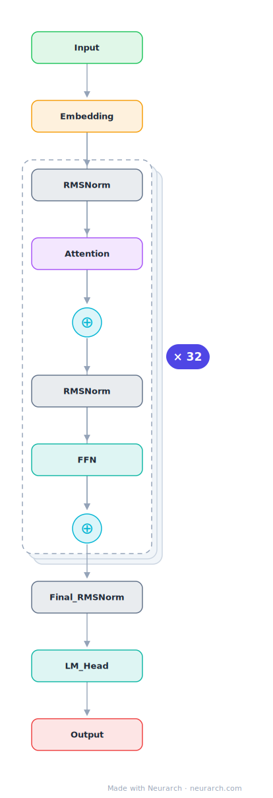

# Llama-3-8B

Meta's 8B dense decoder, the de facto baseline architecture that most current open LLMs (including many in this zoo) derive from or compare against.

## Model URLs

| Where | URL |
|---|---|
| **Open in Neurarch** (live, editable graph) | https://www.neurarch.com/?import=https://raw.githubusercontent.com/neurarch-ai/neurarch-model-zoo/main/architectures/llama3-8b/model.json |
| Hugging Face | https://huggingface.co/meta-llama/Meta-Llama-3-8B |
| GitHub | https://github.com/meta-llama/llama3 |

## Architecture

| Hyperparameter | Value |
|---|---|
| Type | Decoder-only transformer (causal LM) |
| Parameters | 8B |
| Layers | 32 |
| Hidden size | 4096 |
| Attention | Grouped-query: 32 query heads, 8 KV heads |
| Head dim | 128 |
| FFN | SwiGLU, intermediate size 14,336 |
| Normalization | RMSNorm, pre-norm |
| Positions | RoPE (rotary dim 128) |
| Vocabulary | 128,256 |
| Max context | 8,192 |

The diagram and `model.json` show the full forward path with one of the 32 identical decoder blocks expanded (the stack repeats x32). All hyperparameters are taken from the official `config.json` on Hugging Face.

## Design notes

- The reference open-weight architecture of 2024: 32 layers, GQA 32:8, SwiGLU 14336, RMSNorm pre-norm. Half the models in this zoo are best described as deltas against this graph.
- Big vocabulary jump over Llama-2: 128256 tokens (tiktoken-style BPE), which moves a meaningful fraction of parameters into the embedding and head.
- rope_theta raised to 500000 for the native 8192-token context.
- Grouped-query attention arrived at the 8B scale here; Llama-2-7B was still plain MHA.

## Files

| File | What it is |
|---|---|
| [`model.json`](model.json) | The Neurarch graph. Shape-validated; open it at [neurarch.com](https://www.neurarch.com/) to edit or export training code. |
| [`assets/diagram.svg`](assets/diagram.svg) | Vector diagram (papers, slides). |
| [`assets/diagram.png`](assets/diagram.png) | Raster diagram (renders everywhere). |

**License:** Llama 3 Community License. The graph and diagrams here describe the architecture; the model weights remain under the upstream license.
