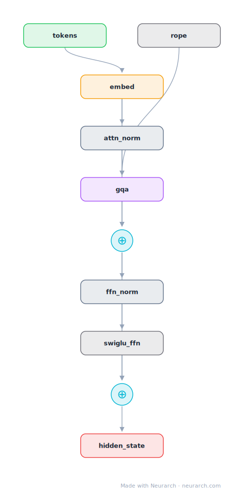

# Llama-3 Decoder Block

A single Llama-3 decoder block at 8B dimensions, expanded to individual operations: RMSNorm, grouped-query attention with RoPE, residual add, RMSNorm, SwiGLU FFN, residual add. The companion to the full [llama3-8b](../llama3-8b/) entry.

## Model URLs

| Where | URL |
|---|---|
| **Open in Neurarch** (live, editable graph) | https://www.neurarch.com/?import=https://raw.githubusercontent.com/neurarch-ai/neurarch-model-zoo/main/architectures/llama3-block/model.json |
| Paper (Llama 3 Herd of Models, 2024) | https://arxiv.org/abs/2407.21783 |
| GitHub | https://github.com/meta-llama/llama3 |
| Hugging Face | https://huggingface.co/meta-llama/Meta-Llama-3-8B |

## Architecture

<b>Layer-by-layer (10 nodes)</b>

| # | Layer | Type | Params |
|---|---|---|---|
| 1 | tokens | `input` | shape: [1, 2048] |
| 2 | embed | `embedding` | numEmbeddings: 128256, embeddingDim: 4096 |
| 3 | attn_norm | `rmsNorm` | normalizedShape: 4096 |
| 4 | gqa | `groupedQueryAttention` | embedDim: 4096, numHeads: 32, numKVHeads: 8 |
| 5 | rope | `rope` | dim: 128, maxSeqLen: 8192 |
| 6 | residual_1 | `add` |   |
| 7 | ffn_norm | `rmsNorm` | normalizedShape: 4096 |
| 8 | swiglu_ffn | `swiglu` | embedDim: 4096, intermediateSize: 14336 |
| 9 | residual_2 | `add` |   |
| 10 | hidden_state | `output` |   |

This graph ships in Neurarch's in-app template library; the copy here passes shape propagation with zero errors.

## Design notes

- Shows the block internals that the full-model entry collapses: both residual streams, the pre-norm placement, and RoPE feeding the attention node.
- GQA 32 query heads over 8 KV heads; SwiGLU intermediate size 14336.
- Useful as a starting graph when you want to modify the block itself (try MoE, different norms, attention variants) and re-validate.

## Files

| File | What it is |
|---|---|
| [`model.json`](model.json) | The Neurarch graph. Shape-validated; open it at [neurarch.com](https://www.neurarch.com/) to edit or export training code. |
| [`assets/diagram.svg`](assets/diagram.svg) | Vector diagram (papers, slides). |
| [`assets/diagram.png`](assets/diagram.png) | Raster diagram (renders everywhere). |
