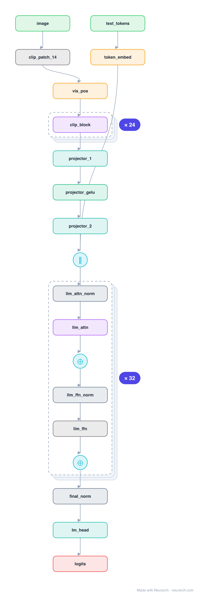

# LLaVA-1.5-7B

The canonical recipe for making an LLM see: a frozen CLIP vision encoder, a tiny MLP projector that maps image-patch features into the LLM's token embedding space, and a Llama decoder that attends over image and text tokens jointly. Simple, and it defined the open multimodal-LLM playbook.

## Model URLs

| Where | URL |
|---|---|
| **Open in Neurarch** (live, editable graph) | https://www.neurarch.com/?import=https://raw.githubusercontent.com/neurarch-ai/awesome-llm-model-zoo/main/architectures/llava-1.5-7b/model.json |
| Paper (Liu et al. 2023) | https://arxiv.org/abs/2310.03744 |
| GitHub | https://github.com/haotian-liu/LLaVA |

## Architecture

*Identical repeated blocks are folded into one representative block with a `× N` badge, so the whole architecture fits on screen. `model.json` keeps all 228 nodes (open it in Neurarch to see and edit every layer). Vector: [diagram.svg](assets/diagram.svg).*

| Hyperparameter | Value |
|---|---|
| Type | Multimodal LLM (vision + language) |
| Vision encoder | CLIP ViT-L/14-336 (frozen): 24 blocks, 1024 hidden |
| Projector | 2-layer MLP, 1024 → 4096 (the bridge) |
| LLM | Vicuna/Llama-7B: 32 decoder blocks, 4096 hidden |
| Fusion | Image tokens prepended to text tokens |
| Parameters | ~7B (mostly the LLM) |

`model.json` is the full graph, hand-built against the official config.json.

## Parameter check

Neurarch's per-layer parameter estimate over this graph: **7.06B**.

## Design notes

- The whole trick is the projector: just a 2-layer MLP turning 576 image-patch vectors into 576 "visual tokens" the LLM can read; only it (and the LLM) are trained, the vision encoder stays frozen.
- Visual tokens are concatenated in front of the text tokens, so the unmodified Llama decoder treats the image as a prefix.
- This bridge-into-the-LLM pattern is what most open MLLMs (Qwen-VL, InternVL, ...) still follow.

## Files

| File | What it is |
|---|---|
| [`model.json`](model.json) | The full Neurarch graph (every layer, real dimensions). Open it at [neurarch.com](https://www.neurarch.com/) to edit or export training code. |
| [`assets/diagram.svg`](assets/diagram.svg) / [`.png`](assets/diagram.png) | Architecture diagram (repeated blocks folded with a `× N` badge). |

**License:** Llama 2 Community License (LLM); Apache 2.0 (code). The graph and diagrams here describe the architecture; any referenced weights remain under the upstream license.
