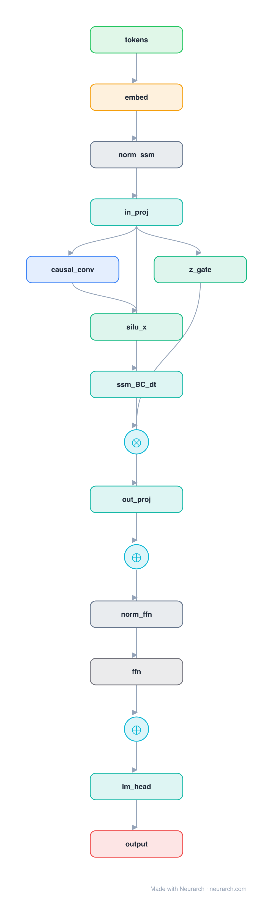

# Mamba SSM Block

The Mamba selective state-space block: causal conv plus gated selective SSM in place of attention, giving linear-time sequence mixing with no KV cache.

## Model URLs

| Where | URL |
|---|---|
| **Open in Neurarch** (live, editable graph) | https://www.neurarch.com/?import=https://raw.githubusercontent.com/neurarch-ai/neurarch-model-zoo/main/architectures/mamba-block/model.json |
| Paper (Gu and Dao 2023) | https://arxiv.org/abs/2312.00752 |
| GitHub | https://github.com/state-spaces/mamba |

## Architecture

<b>Layer-by-layer (16 nodes)</b>

| # | Layer | Type | Params |
|---|---|---|---|
| 1 | tokens | `input` | shape: [1, 1024] |
| 2 | embed | `embedding` | numEmbeddings: 50280, embeddingDim: 1024 |
| 3 | norm_ssm | `rmsNorm` | normalizedShape: 1024 |
| 4 | in_proj | `linear` | outFeatures: 4096, inFeatures: 1024 |
| 5 | causal_conv | `conv1d` | outChannels: 2048, kernelSize: 4, stride: 1, padding: 3, inChannels: 4096 |
| 6 | silu_x | `swish` |   |
| 7 | ssm_BC_dt | `linear` | outFeatures: 128, inFeatures: 4096 |
| 8 | z_gate | `swish` |   |
| 9 | gate_out | `multiply` |   |
| 10 | out_proj | `linear` | outFeatures: 1024, inFeatures: 128 |
| 11 | residual_1 | `add` |   |
| 12 | norm_ffn | `rmsNorm` | normalizedShape: 1024 |
| 13 | ffn | `swiglu` | embedDim: 1024, intermediateSize: 2048 |
| 14 | residual_2 | `add` |   |
| 15 | lm_head | `linear` | outFeatures: 50280, inFeatures: 1024 |
| 16 | output | `output` |   |

This graph ships in Neurarch's in-app template library; the copy here passes shape propagation with zero errors.

## Design notes

- No attention anywhere: the selective SSM scan does the sequence mixing in O(T) time and O(1) inference state.
- The gating path (SiLU-gated multiply) and the input-dependent SSM parameters are what "selective" refers to.
- The strongest attention-free architecture family; hybrids (Jamba, Zamba) interleave this block with attention.

## Files

| File | What it is |
|---|---|
| [`model.json`](model.json) | The Neurarch graph. Shape-validated; open it at [neurarch.com](https://www.neurarch.com/) to edit or export training code. |
| [`assets/diagram.svg`](assets/diagram.svg) | Vector diagram (papers, slides). |
| [`assets/diagram.png`](assets/diagram.png) | Raster diagram (renders everywhere). |
