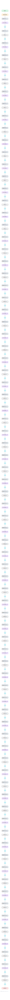

# MiniCPM-2B

OpenBMB's flagship small LLM, a 2.4B deep-and-thin decoder that punches above its weight via muP-style scaling (scale_emb, scaled residuals, tied embeddings) found by extensive scaling-law sweeps.

## Model URLs

| Where | URL |
|---|---|
| **Open in Neurarch** (live, editable graph) | https://www.neurarch.com/?import=https://raw.githubusercontent.com/neurarch-ai/neurarch-model-zoo/main/architectures/minicpm-2b/model.json |
| Hugging Face | https://huggingface.co/openbmb/MiniCPM-2B-sft-bf16 |
| GitHub | https://github.com/OpenBMB/MiniCPM |

## Architecture

| Hyperparameter | Value |
|---|---|
| Type | Decoder-only transformer (causal LM) |
| Parameters | 2.4B (non-embedding) |
| Layers | 40 |
| Hidden size | 2304 |
| Attention | Multi-head: 36 heads |
| Head dim | 64 |
| FFN | SwiGLU, intermediate size 5,760 |
| Normalization | RMSNorm, pre-norm |
| Positions | RoPE (rotary dim 64) |
| Vocabulary | 122,753 |
| Max context | 4,096 |

The diagram and `model.json` show the full forward path with one of the 40 identical decoder blocks expanded (the stack repeats x40). All hyperparameters are taken from the official `config.json` on Hugging Face.

## Design notes

- Deep-and-thin: 40 layers at only 2304 hidden, the opposite trade-off from most 2B-class models.
- muP-style stability tricks baked into the architecture: embedding output scaled by scale_emb = 12, residual branches scaled by scale_depth / sqrt(num_layers), and tied input/output embeddings.
- Plain multi-head attention (36 heads, 64-dim each); the KV-cache saving tricks were left out at this scale.
- A 122753-token vocabulary, very large for a 2B model, reflecting its Chinese-first design.

## Files

| File | What it is |
|---|---|
| [`model.json`](model.json) | The Neurarch graph. Shape-validated; open it at [neurarch.com](https://www.neurarch.com/) to edit or export training code. |
| [`assets/diagram.svg`](assets/diagram.svg) | Vector diagram (papers, slides). |
| [`assets/diagram.png`](assets/diagram.png) | Raster diagram (renders everywhere). |

**License:** Apache 2.0 (code); weights free for commercial use after registration. The graph and diagrams here describe the architecture; the model weights remain under the upstream license.
