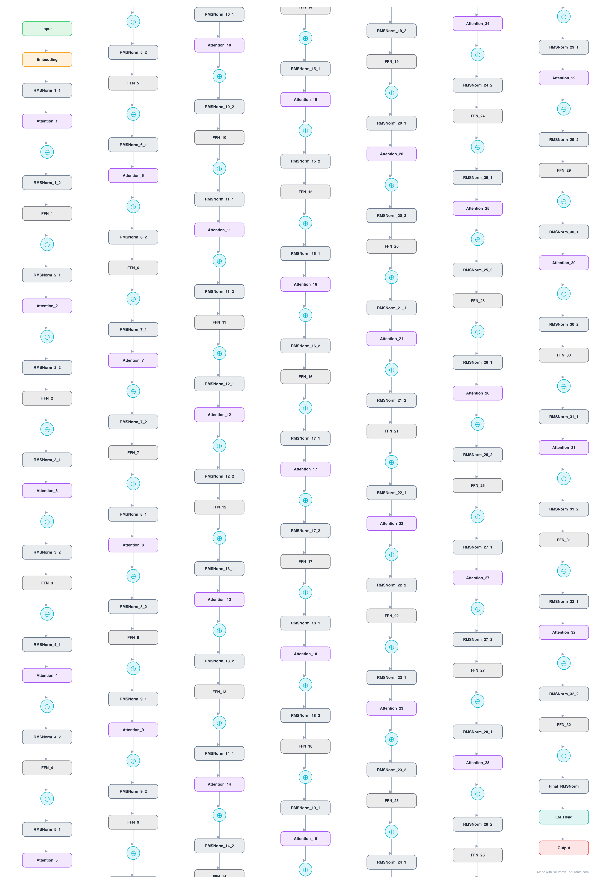

# Mistral-7B

The 7B model from Mistral AI that beat Llama-2-13B at release, built on grouped-query attention plus sliding-window attention. The direct dense ancestor of Mixtral.

## Model URLs

| Where | URL |
|---|---|
| **Open in Neurarch** (live, editable graph) | https://www.neurarch.com/?import=https://raw.githubusercontent.com/neurarch-ai/awesome-llm-model-zoo/main/architectures/mistral-7b/model.json |
| Hugging Face | https://huggingface.co/mistralai/Mistral-7B-v0.1 |
| GitHub | https://github.com/mistralai/mistral-inference |

## Architecture

*Identical repeated blocks are folded into one representative block with a `× N` badge, so the whole architecture fits on screen. `model.json` keeps all 197 nodes (open it in Neurarch to see and edit every layer). Vector: [diagram.svg](assets/diagram.svg).*

| Hyperparameter | Value |
|---|---|
| Type | Decoder-only transformer (causal LM) |
| Parameters | 7.2B |
| Layers | 32 |
| Hidden size | 4096 |
| Attention | Grouped-query: 32 query heads, 8 KV heads |
| Head dim | 128 |
| FFN | SwiGLU, intermediate size 14,336 |
| Normalization | RMSNorm, pre-norm |
| Positions | RoPE (rotary dim 128) |
| Vocabulary | 32,000 |
| Max context | 32,768 |

`model.json` is the full 32-layer graph, produced with the same import path the Neurarch app uses for "load from Hugging Face", with all hyperparameters from the official `config.json`.

## Parameter check

Neurarch's per-layer parameter estimate over this graph: **7.24B**.
Hugging Face safetensors metadata reports **7.24B** for the real weights.
Deviation from the authoritative count (7.24B): **+0.0%**.

## Design notes

- Sliding-window attention: each layer attends to the previous 4096 tokens only; stacking 32 layers grows the effective receptive field to the full 32768-token context. The graph shows standard GQA; the window is an attention-mask detail.
- Grouped-query attention 32:8 plus the sliding window made it the fastest-inference 7B of its generation.
- Kept the compact Llama-2 32000-token vocabulary while adopting the larger 14336 FFN.
- The dense base that Mixtral 8x7B sparsified: the MoE model reuses this exact block with the FFN swapped for 8 experts.

## Files

| File | What it is |
|---|---|
| [`model.json`](model.json) | The full Neurarch graph (every layer, real dimensions). Open it at [neurarch.com](https://www.neurarch.com/) to edit or export training code. |
| [`assets/diagram.svg`](assets/diagram.svg) / [`.png`](assets/diagram.png) | Architecture diagram (repeated blocks folded with a `× N` badge). |

**License:** Apache 2.0. The graph and diagrams here describe the architecture; the model weights remain under the upstream license.
