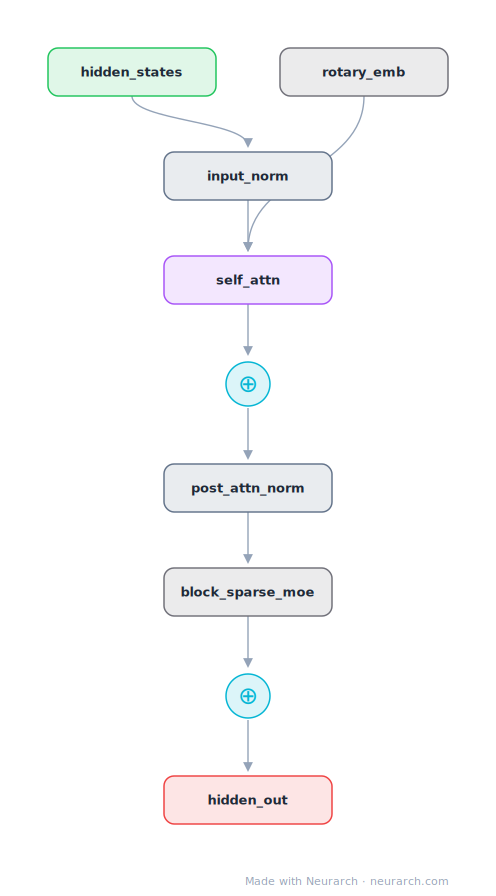

# Mixtral MoE Block

The Mixtral 8x7B decoder block: the Mistral-7B block with its dense FFN swapped for a sparse mixture of 8 expert FFNs, top-2 routed per token.

## Model URLs

| Where | URL |
|---|---|
| **Open in Neurarch** (live, editable graph) | https://www.neurarch.com/?import=https://raw.githubusercontent.com/neurarch-ai/neurarch-model-zoo/main/architectures/mixtral-block/model.json |
| Paper (Jiang et al. 2024) | https://arxiv.org/abs/2401.04088 |
| Hugging Face | https://huggingface.co/mistralai/Mixtral-8x7B-v0.1 |

## Architecture

<b>Layer-by-layer (9 nodes)</b>

| # | Layer | Type | Params |
|---|---|---|---|
| 1 | hidden_states | `input` | shape: [1, 4096, 4096] |
| 2 | input_norm | `rmsNorm` | normalizedShape: 4096 |
| 3 | self_attn | `groupedQueryAttention` | embedDim: 4096, numHeads: 32, numKVHeads: 8 |
| 4 | rotary_emb | `rope` | dim: 128 |
| 5 | attn_residual | `add` |   |
| 6 | post_attn_norm | `rmsNorm` | normalizedShape: 4096 |
| 7 | block_sparse_moe | `moeLayer` | embedDim: 4096, numExperts: 8, topK: 2, expertDim: 14336 |
| 8 | moe_residual | `add` |   |
| 9 | hidden_out | `output` |   |

This graph ships in Neurarch's in-app template library; the copy here passes shape propagation with zero errors.

## Design notes

- Sparse MoE layer: 8 experts, top-2 routing, so roughly 13B of 47B total parameters are active per token.
- Everything around the MoE layer is the Mistral-7B recipe: GQA 32:8 with RoPE, RMSNorm pre-norm, dual residual streams.
- The canonical open-weight example of decoupling parameter count from inference FLOPs.

## Files

| File | What it is |
|---|---|
| [`model.json`](model.json) | The Neurarch graph. Shape-validated; open it at [neurarch.com](https://www.neurarch.com/) to edit or export training code. |
| [`assets/diagram.svg`](assets/diagram.svg) | Vector diagram (papers, slides). |
| [`assets/diagram.png`](assets/diagram.png) | Raster diagram (renders everywhere). |
