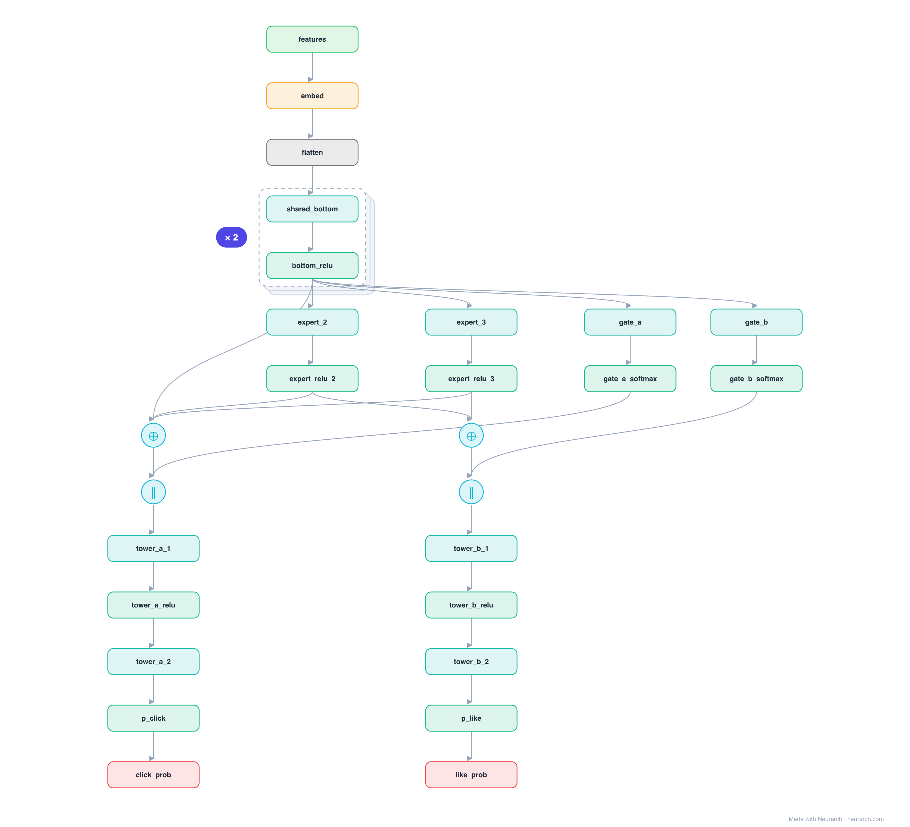

# MMoE

Multi-gate Mixture-of-Experts: instead of one shared bottom feeding every task (which forces conflicting objectives to share a representation), MMoE gives each task a softmax gate that mixes a shared pool of experts its own way. The default multi-task ranker behind feed and video systems that optimize several objectives at once.

## Model URLs

| Where | URL |
|---|---|
| **Open in Neurarch** (live, editable graph) | https://www.neurarch.com/?import=https://raw.githubusercontent.com/neurarch-ai/awesome-llm-model-zoo/main/architectures/mmoe/model.json |
| Paper (Ma et al. 2018) | https://dl.acm.org/doi/10.1145/3219819.3220007 |

## Architecture

*Identical repeated blocks are folded into one representative block with a `× N` badge, so the whole architecture fits on screen. `model.json` keeps all 29 nodes (open it in Neurarch to see and edit every layer). Vector: [diagram.svg](assets/diagram.svg).*

| Hyperparameter | Value |
|---|---|
| Type | Multi-task ranking |
| Experts | Shared bottom feeds N expert MLPs |
| Gates | Per-task softmax gate over the experts |
| Towers | One MLP head per objective |
| Key idea | Soft expert sharing avoids multi-task negative transfer |

`model.json` is the full graph, hand-built against the official config.json.

## Parameter check

This entry is a **structural reference**: its parameter mix is not recomputed by the per-layer estimator, so it carries no deviation gate. See the hyperparameter table above for the authoritative total / active parameter counts.

## Design notes

- Every task reads the same experts but through its own gate, so tasks that disagree can lean on different experts without a hard split.
- Reference topology: the per-task gate softmax is shown joining the expert mixture; in the paper the gate weights are the mixture coefficients.
- Compare [ple](../ple/), which hardens the soft gating into explicit task-specific vs shared expert groups.

## Files

| File | What it is |
|---|---|
| [`model.json`](model.json) | The full Neurarch graph (every layer, real dimensions). Open it at [neurarch.com](https://www.neurarch.com/) to edit or export training code. |
| [`assets/diagram.svg`](assets/diagram.svg) / [`.png`](assets/diagram.png) | Architecture diagram (repeated blocks folded with a `× N` badge). |
