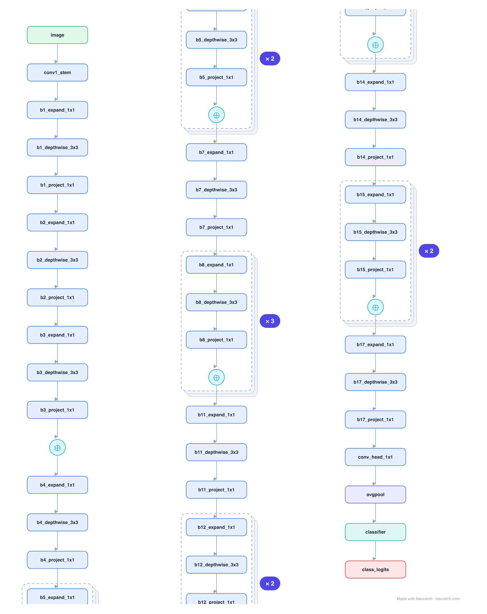

# MobileNetV2

The on-device vision workhorse. Its inverted residual block expands to a wide intermediate, does a cheap depthwise 3x3 there, then projects back down through a linear bottleneck, packing accuracy into 3.5M parameters and the staple of mobile / CoreML model zoos.

## Model URLs

| Where | URL |
|---|---|
| **Open in Neurarch** (live, editable graph) | https://www.neurarch.com/?import=https://raw.githubusercontent.com/neurarch-ai/awesome-llm-model-zoo/main/architectures/mobilenet-v2/model.json |
| Paper (Sandler et al. 2018) | https://arxiv.org/abs/1801.04381 |
| Hugging Face | https://huggingface.co/google/mobilenet_v2_1.0_224 |

## Architecture

*Identical repeated blocks are folded into one representative block with a `× N` badge, so the whole architecture fits on screen. `model.json` keeps all 67 nodes (open it in Neurarch to see and edit every layer). Vector: [diagram.svg](assets/diagram.svg).*

| Hyperparameter | Value |
|---|---|
| Type | Efficient convolutional network |
| Parameters | 3.5M |
| Stem | 3x3/2 conv (32 channels) |
| Body | 17 inverted-residual blocks |
| Inverted residual | expand 1x1 → depthwise 3x3 → project 1x1 (linear bottleneck) |
| Head | 1x1 conv (1280) → global avg pool → FC-1000 |
| Input | 3x224x224 |

`model.json` is the full graph, hand-built against the official config.json.

## Parameter check

Neurarch's per-layer parameter estimate over this graph: **3.5M**.

## Design notes

- Inverted residual: unlike ResNet (wide → narrow → wide), MobileNetV2 goes narrow → wide → narrow, and the skip connects the narrow bottlenecks (where the information lives).
- Linear bottleneck: the projection has no ReLU, because ReLU destroys information in low-dimensional space.
- Depthwise-separable convs (the 3x3 acts per-channel) are what make it cheap; full graph with every block expanded.

## Files

| File | What it is |
|---|---|
| [`model.json`](model.json) | The full Neurarch graph (every layer, real dimensions). Open it at [neurarch.com](https://www.neurarch.com/) to edit or export training code. |
| [`assets/diagram.svg`](assets/diagram.svg) / [`.png`](assets/diagram.png) | Architecture diagram (repeated blocks folded with a `× N` badge). |

**License:** Apache 2.0. The graph and diagrams here describe the architecture; any referenced weights remain under the upstream license.
