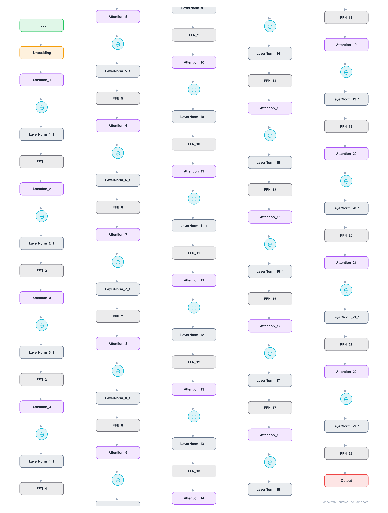

# ModernBERT-Base

The 2024 rebuild of BERT with a decade of decoder-side lessons applied: RoPE, GeGLU, pre-norm, no biases, and 5:1 local:global attention for an 8192-token context. The new default encoder for retrieval and classification.

## Model URLs

| Where | URL |
|---|---|
| **Open in Neurarch** (live, editable graph) | https://www.neurarch.com/?import=https://raw.githubusercontent.com/neurarch-ai/neurarch-model-zoo/main/architectures/modernbert-base/model.json |
| Paper (Warner et al. 2024) | https://arxiv.org/abs/2412.13663 |
| Hugging Face | https://huggingface.co/answerdotai/ModernBERT-base |
| GitHub | https://github.com/AnswerDotAI/ModernBERT |

## Architecture

*The full graph, all 91 nodes, tiled into columns for readability (read each column top-to-bottom, then left-to-right). Exactly what `model.json` holds. Vector: [diagram.svg](assets/diagram.svg).*

| Hyperparameter | Value |
|---|---|
| Type | Bidirectional encoder |
| Parameters | 149M |
| Layers | 22 |
| Hidden size | 768 |
| Attention | 12 heads; 5:1 local(128):global, RoPE |
| FFN | GeGLU, 1152 (paired) |
| Normalization | LayerNorm (bias-free), pre-norm |
| Positions | RoPE (theta 10000 local / 160000 global) |
| Vocabulary | 50,368 |
| Max context | 8,192 |

`model.json` is the full graph, produced with the same import path the Neurarch app uses for "load from Hugging Face" (with importer fixes noted in the generator script).

## Parameter check

Neurarch's per-layer parameter estimate over this graph: **149.1M**.
Hugging Face safetensors metadata reports **149.7M** for the real weights.
Deviation from the authoritative count (149.7M): **-0.4%**.

## Design notes

- Every modernization is borrowed from the LLM stack: rotary positions replace absolute embeddings, GeGLU replaces the GeLU MLP, pre-norm replaces post-norm, and all bias terms are dropped (verified from config.json).
- Alternating attention: 2 of every 3 layers use a 128-token local window; every 3rd layer is global. That is how 22 layers reach 8192 tokens cheaply.
- Deeper and thinner than BERT-base (22 layers vs 12, FFN 1152 paired for GeGLU) at a comparable 149M parameters.
- Compare with [bert-base](../bert-base/) side by side: same job, nine years of architecture evolution.

## Files

| File | What it is |
|---|---|
| [`model.json`](model.json) | The full Neurarch graph (every layer, real dimensions). Open it at [neurarch.com](https://www.neurarch.com/) to edit or export training code. |
| [`assets/diagram.svg`](assets/diagram.svg) / [`.png`](assets/diagram.png) | Diagram of the full graph. |

**License:** Apache 2.0. The graph and diagrams here describe the architecture; any referenced weights remain under the upstream license.
