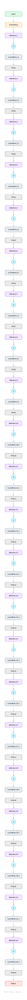

# ModernBERT-Base

The 2024 rebuild of BERT with a decade of decoder-side lessons applied: RoPE, GeGLU, pre-norm, no biases, and 5:1 local:global attention for an 8192-token context. The new default encoder for retrieval and classification.

## Model URLs

| Where | URL |
|---|---|
| **Open in Neurarch** (live, editable graph) | https://www.neurarch.com/?import=https://raw.githubusercontent.com/neurarch-ai/neurarch-model-zoo/main/architectures/modernbert-base/model.json |
| Paper (Warner et al. 2024) | https://arxiv.org/abs/2412.13663 |
| Hugging Face | https://huggingface.co/answerdotai/ModernBERT-base |
| GitHub | https://github.com/AnswerDotAI/ModernBERT |

## Architecture

<b>Layer-by-layer (12 nodes)</b>

| # | Layer | Type | Params |
|---|---|---|---|
| 1 | input_ids | `input` | shape: [1, 8192] |
| 2 | tok_embed | `embedding` | numEmbeddings: 50368, embeddingDim: 768 |
| 3 | embed_norm | `layerNorm` | normalizedShape: 768 |
| 4 | attn_norm | `layerNorm` | normalizedShape: 768 |
| 5 | self_attn | `multiHeadAttention` | embedDim: 768, numHeads: 12 |
| 6 | rope | `rope` | dim: 64 |
| 7 | residual_1 | `add` |   |
| 8 | ffn_norm | `layerNorm` | normalizedShape: 768 |
| 9 | geglu_ffn | `geglu` | dim: 768, hiddenDim: 1152 |
| 10 | residual_2 | `add` |   |
| 11 | final_norm | `layerNorm` | normalizedShape: 768 |
| 12 | hidden_states | `output` |   |

This graph is hand-built for the zoo, passes shape propagation with zero errors, and has its key dimensions verified against the official config.json.

## Design notes

- Every modernization is borrowed from the LLM stack: rotary positions replace absolute embeddings, GeGLU replaces the GeLU MLP, pre-norm replaces post-norm, and all bias terms are dropped (verified from config.json).
- Alternating attention: 2 of every 3 layers use a 128-token local window; every 3rd layer is global. That is how 22 layers reach 8192 tokens cheaply.
- Deeper and thinner than BERT-base (22 layers vs 12, FFN 1152 paired for GeGLU) at a comparable 149M parameters.
- Compare with [bert-base](../bert-base/) side by side: same job, nine years of architecture evolution.

## Files

| File | What it is |
|---|---|
| [`model.json`](model.json) | The Neurarch graph. Shape-validated; open it at [neurarch.com](https://www.neurarch.com/) to edit or export training code. |
| [`assets/diagram.svg`](assets/diagram.svg) | Vector diagram (papers, slides). |
| [`assets/diagram.png`](assets/diagram.png) | Raster diagram (renders everywhere). |

**License:** Apache 2.0. The graph and diagrams here describe the architecture; any referenced weights remain under the upstream license.
