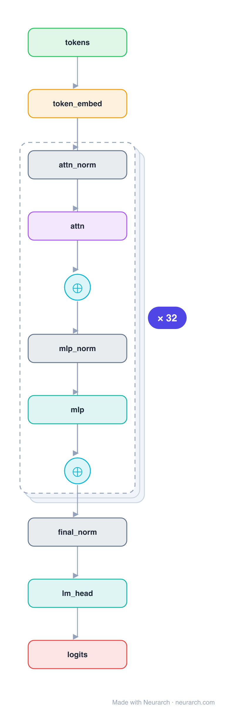

# MPT-7B

MosaicML's 2023 open, commercially-usable LLM. Its defining choice is ALiBi: instead of learned or rotary position embeddings, it biases attention scores by a linear penalty on key-query distance, which lets the model extrapolate to context lengths well beyond training. No biases, tied embeddings, plain GELU MLP.

## Model URLs

| Where | URL |
|---|---|
| **Open in Neurarch** (live, editable graph) | https://www.neurarch.com/?import=https://raw.githubusercontent.com/neurarch-ai/awesome-llm-model-zoo/main/architectures/mpt-7b/model.json |
| Blog (MosaicML) | https://www.databricks.com/blog/mpt-7b-7b-8k |
| Hugging Face | https://huggingface.co/mosaicml/mpt-7b |

## Architecture

*Identical repeated blocks are folded into one representative block with a `× N` badge, so the whole architecture fits on screen. `model.json` keeps all 197 nodes (open it in Neurarch to see and edit every layer). Vector: [diagram.svg](assets/diagram.svg).*

| Hyperparameter | Value |
|---|---|
| Type | Decoder-only transformer (causal LM) |
| Parameters | 6.6B |
| Layers | 32 |
| Hidden size | 4,096 |
| Attention | Multi-head: 32 heads, head dim 128 |
| FFN | GELU MLP, intermediate size 16,384 (4x) |
| Normalization | LayerNorm, pre-norm |
| Positions | ALiBi (linear attention bias, no positional embeddings) |
| Vocabulary | 50,432 |
| Max context | 2,048 trained; extrapolates via ALiBi |

`model.json` is the full graph, hand-built against the official config.json.

## Parameter check

Neurarch's per-layer parameter estimate over this graph: **6.65B**.
Deviation from the authoritative count (6.65B): **+0.0%**.

> MPT ties the LM head to the token embedding, so the 50,432 x 4,096 matrix is counted once.

## Design notes

- ALiBi (Attention with Linear Biases): no positional embedding tensor at all; a fixed per-head linear distance penalty is added to attention scores, enabling length extrapolation.
- No biases anywhere and tied input/output embeddings, keeping the parameter count tight.
- Standard multi-head attention with a 128 head dim; a clean baseline for the ALiBi positional approach.

## Files

| File | What it is |
|---|---|
| [`model.json`](model.json) | The full Neurarch graph (every layer, real dimensions). Open it at [neurarch.com](https://www.neurarch.com/) to edit or export training code. |
| [`assets/diagram.svg`](assets/diagram.svg) / [`.png`](assets/diagram.png) | Architecture diagram (repeated blocks folded with a `× N` badge). |

**License:** Apache 2.0. The graph and diagrams here describe the architecture; any referenced weights remain under the upstream license.
