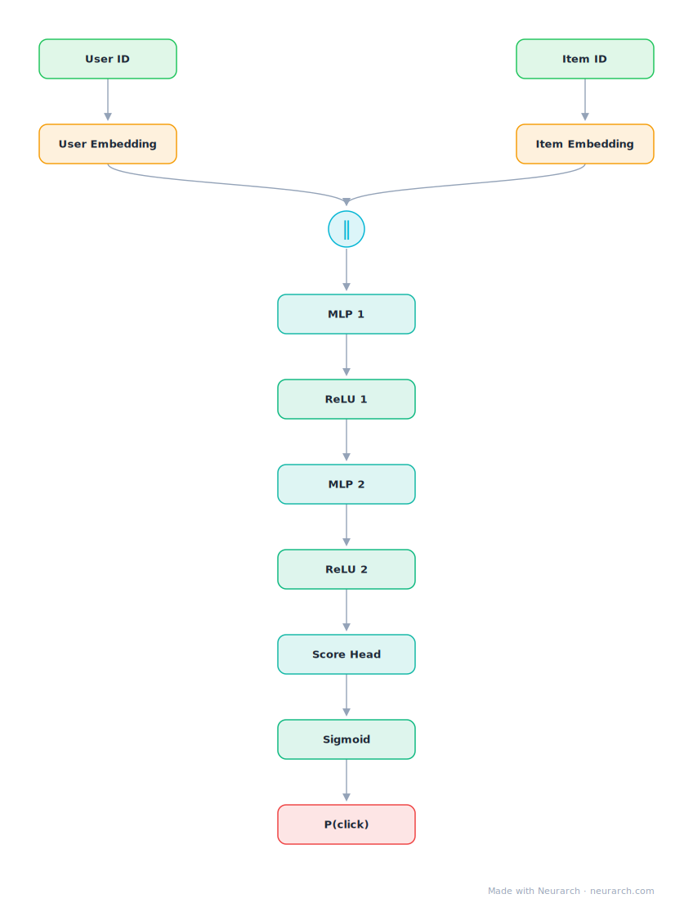

# NCF (concat-MLP)

Neural Collaborative Filtering in its simplest form: user and item embeddings concatenated into an MLP that learns the interaction function instead of assuming a dot product.

## Model URLs

| Where | URL |
|---|---|
| **Open in Neurarch** (live, editable graph) | https://www.neurarch.com/?import=https://raw.githubusercontent.com/neurarch-ai/neurarch-model-zoo/main/architectures/ncf/model.json |
| Paper (He et al. 2017) | https://arxiv.org/abs/1708.05031 |
| GitHub | https://github.com/hexiangnan/neural_collaborative_filtering |

## Architecture

<b>Layer-by-layer (12 nodes)</b>

| # | Layer | Type | Params |
|---|---|---|---|
| 1 | User ID | `input` | shape: [1] |
| 2 | User Embedding | `embedding` | vocabSize: 100000, embeddingDim: 32 |
| 3 | Item ID | `input` | shape: [1] |
| 4 | Item Embedding | `embedding` | vocabSize: 1000000, embeddingDim: 32 |
| 5 | Concat [u; i] | `concatenate` | dim: -1, numInputs: 2 |
| 6 | MLP 1 | `linear` | inFeatures: 64, outFeatures: 64 |
| 7 | ReLU 1 | `relu` |   |
| 8 | MLP 2 | `linear` | inFeatures: 64, outFeatures: 32 |
| 9 | ReLU 2 | `relu` |   |
| 10 | Score Head | `linear` | inFeatures: 32, outFeatures: 1 |
| 11 | Sigmoid | `sigmoid` |   |
| 12 | P(click) | `output` |   |

This graph ships in Neurarch's in-app template library; the copy here passes shape propagation with zero errors.

## Design notes

- The pure-MLP variant of the NCF paper; the fused GMF+MLP variant is the separate [neumf](../neumf/) entry.
- The paper's claim that an MLP beats the inner product sparked a years-long replication debate (Rendle et al. 2020); keep both graphs around to test it yourself.

## Files

| File | What it is |
|---|---|
| [`model.json`](model.json) | The Neurarch graph. Shape-validated; open it at [neurarch.com](https://www.neurarch.com/) to edit or export training code. |
| [`assets/diagram.svg`](assets/diagram.svg) | Vector diagram (papers, slides). |
| [`assets/diagram.png`](assets/diagram.png) | Raster diagram (renders everywhere). |
