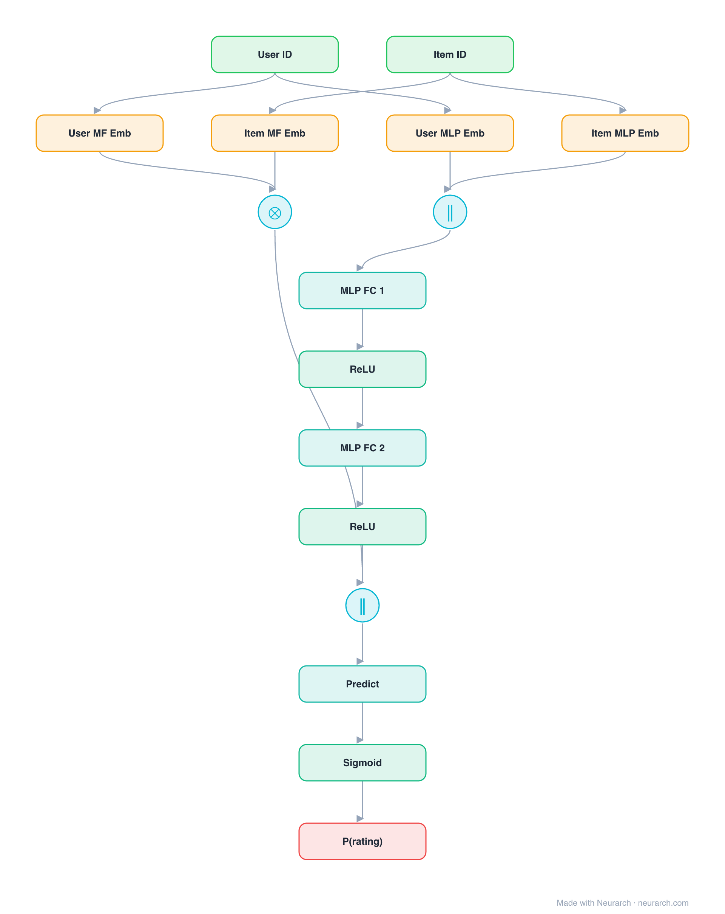

# NeuMF (GMF + MLP)

The full NCF model: a Generalized Matrix Factorization path (element-wise product of embeddings) fused with an MLP path, each with its own embedding tables, joined before the final score.

## Model URLs

| Where | URL |
|---|---|
| **Open in Neurarch** (live, editable graph) | https://www.neurarch.com/?import=https://raw.githubusercontent.com/neurarch-ai/awesome-llm-model-zoo/main/architectures/neumf/model.json |
| Paper (He et al. 2017) | https://arxiv.org/abs/1708.05031 |
| GitHub | https://github.com/hexiangnan/neural_collaborative_filtering |

## Architecture

<b>Layer-by-layer (16 nodes)</b>

| # | Layer | Type | Params |
|---|---|---|---|
| 1 | User ID | `input` | shape: [1] |
| 2 | Item ID | `input` | shape: [1] |
| 3 | User MF Emb | `embedding` | vocabSize: 100000, embeddingDim: 32 |
| 4 | Item MF Emb | `embedding` | vocabSize: 1000000, embeddingDim: 32 |
| 5 | User MLP Emb | `embedding` | vocabSize: 100000, embeddingDim: 64 |
| 6 | Item MLP Emb | `embedding` | vocabSize: 1000000, embeddingDim: 64 |
| 7 | GMF (⊙) | `multiply` |   |
| 8 | Concat | `concatenate` | axis: -1 |
| 9 | MLP FC 1 | `linear` | inFeatures: 128, outFeatures: 64 |
| 10 | ReLU | `relu` |   |
| 11 | MLP FC 2 | `linear` | inFeatures: 64, outFeatures: 32 |
| 12 | ReLU | `relu` |   |
| 13 | Fuse GMF+MLP | `concatenate` | axis: -1 |
| 14 | Predict | `linear` | inFeatures: 64, outFeatures: 1 |
| 15 | Sigmoid | `sigmoid` |   |
| 16 | P(rating) | `output` |   |

This graph ships in Neurarch's in-app template library; the copy here passes shape propagation with zero errors.

## Design notes

- Two separate embedding sets, one per path, concatenated at the last layer: the structural detail most reimplementations get wrong.
- GMF preserves the classic MF inductive bias while the MLP path adds flexibility; the fusion is the paper's actual headline model.

## Files

| File | What it is |
|---|---|
| [`model.json`](model.json) | The Neurarch graph. Shape-validated; open it at [neurarch.com](https://www.neurarch.com/) to edit or export training code. |
| [`assets/diagram.svg`](assets/diagram.svg) | Vector diagram (papers, slides). |
| [`assets/diagram.png`](assets/diagram.png) | Raster diagram (renders everywhere). |
