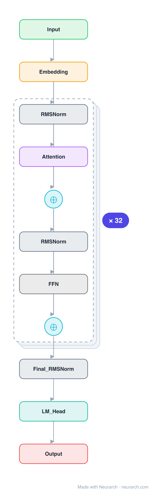

# OLMo-7B

Ai2's fully-open 7B: not just open weights but open training data (Dolma), code, and logs. A Llama-shaped decoder with one signature twist, non-parametric LayerNorm, included as the reference for reproducible LLM research.

## Model URLs

| Where | URL |
|---|---|
| **Open in Neurarch** (live, editable graph) | https://www.neurarch.com/?import=https://raw.githubusercontent.com/neurarch-ai/awesome-llm-model-zoo/main/architectures/olmo-7b/model.json |
| Paper (Groeneveld et al. 2024) | https://arxiv.org/abs/2402.00838 |
| Hugging Face | https://huggingface.co/allenai/OLMo-7B-0724-hf |
| GitHub | https://github.com/allenai/OLMo |

## Architecture

*Identical repeated blocks are folded into one representative block with a `× N` badge, so the whole architecture fits on screen. `model.json` keeps all 197 nodes (open it in Neurarch to see and edit every layer). Vector: [diagram.svg](assets/diagram.svg).*

| Hyperparameter | Value |
|---|---|
| Type | Decoder-only transformer (causal LM) |
| Parameters | 6.9B |
| Layers | 32 |
| Hidden size | 4096 |
| Attention | Multi-head: 32 heads |
| FFN | SwiGLU, intermediate size 11008 |
| Normalization | Non-parametric LayerNorm (no weight / bias) |
| Positions | RoPE |
| Vocabulary | 50,304 |
| Max context | 4,096 |

`model.json` is the full graph, produced with the same import path the Neurarch app uses for "load from Hugging Face".

## Parameter check

Neurarch's per-layer parameter estimate over this graph: **6.89B**.
Hugging Face safetensors metadata reports **6.89B** for the real weights.
Deviation from the authoritative count (6.89B): **+0.0%**.

## Design notes

- Non-parametric LayerNorm: the norm has no learnable gain or bias at all, just the normalization, which the OLMo report found improved stability.
- Otherwise a clean Llama-style decoder: RoPE, SwiGLU, no biases, untied embeddings.
- The point is end-to-end openness (Dolma corpus + training code + checkpoints), making it the model to use when you need to know exactly what went in.

## Files

| File | What it is |
|---|---|
| [`model.json`](model.json) | The full Neurarch graph (every layer, real dimensions). Open it at [neurarch.com](https://www.neurarch.com/) to edit or export training code. |
| [`assets/diagram.svg`](assets/diagram.svg) / [`.png`](assets/diagram.png) | Architecture diagram (repeated blocks folded with a `× N` badge). |

**License:** Apache 2.0. The graph and diagrams here describe the architecture; any referenced weights remain under the upstream license.
