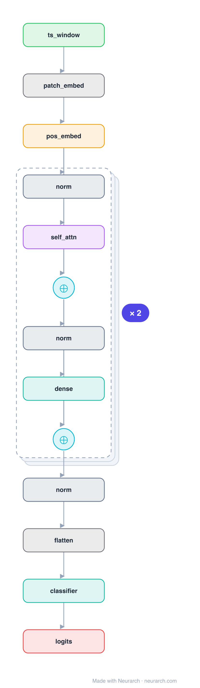

# PatchTST

The Transformer that made long-horizon time-series forecasting work: each variable is sliced into patches (like ViT, but in time) and encoded channel-independently by a shared Transformer.

## Model URLs

| Where | URL |
|---|---|
| **Open in Neurarch** (live, editable graph) | https://www.neurarch.com/?import=https://raw.githubusercontent.com/neurarch-ai/awesome-llm-model-zoo/main/architectures/patch-tst/model.json |
| Paper (Nie et al. 2023) | https://arxiv.org/abs/2211.14730 |
| GitHub | https://github.com/yuqinie98/PatchTST |

## Architecture

<b>Layer-by-layer (19 nodes)</b>

| # | Layer | Type | Params |
|---|---|---|---|
| 1 | ts_window | `input` | shape: [1, 22, 1000] |
| 2 | patch_embed | `patchEmbed` | patchSize: 16, stride: 8, embedDim: 128 |
| 3 | pos_embed | `positionalEncoding` | maxLen: 256, embedDim: 128 |
| 4 | norm | `layerNorm` | normalizedShape: 128 |
| 5 | self_attn | `multiHeadAttention` | embedDim: 128, numHeads: 16 |
| 6 | residual | `add` |   |
| 7 | norm | `layerNorm` | normalizedShape: 128 |
| 8 | dense | `feedForward` | embedDim: 128, ffDim: 256 |
| 9 | residual | `add` |   |
| 10 | norm | `layerNorm` | normalizedShape: 128 |
| 11 | self_attn | `multiHeadAttention` | embedDim: 128, numHeads: 16 |
| 12 | residual | `add` |   |
| 13 | norm | `layerNorm` | normalizedShape: 128 |
| 14 | dense | `feedForward` | embedDim: 128, ffDim: 256 |
| 15 | residual | `add` |   |
| 16 | norm | `layerNorm` | normalizedShape: 128 |
| 17 | flatten | `flatten` |   |
| 18 | classifier | `linear` | outFeatures: 4, inFeatures: NaN |
| 19 | logits | `output` |   |

This graph ships in Neurarch's in-app template library; the copy here passes shape propagation with zero errors.

## Design notes

- Patching cuts sequence length quadratically for attention and gives each token local semantic content.
- Channel independence (one shared encoder applied per variable) beat channel-mixing on the standard long-horizon benchmarks.

## Files

| File | What it is |
|---|---|
| [`model.json`](model.json) | The Neurarch graph. Shape-validated; open it at [neurarch.com](https://www.neurarch.com/) to edit or export training code. |
| [`assets/diagram.svg`](assets/diagram.svg) | Vector diagram (papers, slides). |
| [`assets/diagram.png`](assets/diagram.png) | Raster diagram (renders everywhere). |
