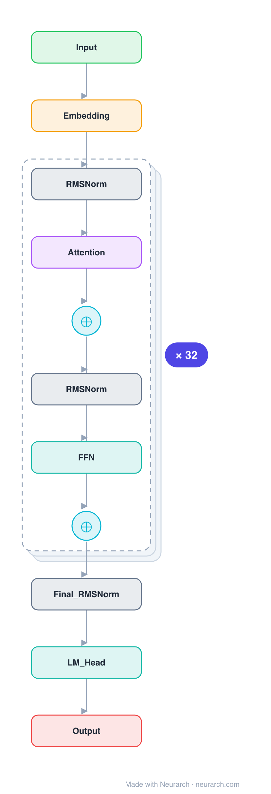

# Phi-2

Microsoft's 2.7B "small model, textbook-quality data" flagship. Architecturally a GPT-NeoX-style parallel-residual decoder with partial rotary embeddings, included as the canonical example of the Phi data-over-scale thesis.

## Model URLs

| Where | URL |
|---|---|
| **Open in Neurarch** (live, editable graph) | https://www.neurarch.com/?import=https://raw.githubusercontent.com/neurarch-ai/awesome-llm-model-zoo/main/architectures/phi-2/model.json |
| Paper / blog (Textbooks Are All You Need II) | https://arxiv.org/abs/2309.05463 |
| Hugging Face | https://huggingface.co/microsoft/phi-2 |

## Architecture

*Identical repeated blocks are folded into one representative block with a `× N` badge, so the whole architecture fits on screen. `model.json` keeps all 197 nodes (open it in Neurarch to see and edit every layer). Vector: [diagram.svg](assets/diagram.svg).*

| Hyperparameter | Value |
|---|---|
| Type | Decoder-only transformer (causal LM) |
| Parameters | 2.78B |
| Layers | 32 |
| Hidden size | 2560 |
| Attention | Multi-head: 32 heads, head dim 80 |
| Block | Parallel residual (attention and MLP share one input) |
| FFN | Dense MLP, 10240, GeLU |
| Normalization | LayerNorm, pre-norm |
| Positions | Partial RoPE (40% of each head) |
| Vocabulary | 51,200 |
| Max context | 2,048 |

`model.json` is the full graph, produced with the same import path the Neurarch app uses for "load from Hugging Face".

## Parameter check

Neurarch's per-layer parameter estimate over this graph: **2.78B**.
Hugging Face safetensors metadata reports **2.78B** for the real weights.
Deviation from the authoritative count (2.78B): **-0.0%**.

## Design notes

- Parallel residual: attention and the MLP both read the same pre-norm input and their outputs are summed into the residual, so the two run side by side instead of in series (saves a norm, slightly faster).
- Partial RoPE: rotary embeddings are applied to only 40% of each 80-dim head; the rest is position-free, a GPT-NeoX inheritance.
- Plain dense GeLU MLP at 4x hidden, no GQA, no SwiGLU: the architecture is deliberately conventional. The Phi result is about data curation, not architecture.
- Untied input/output embeddings.

## Files

| File | What it is |
|---|---|
| [`model.json`](model.json) | The full Neurarch graph (every layer, real dimensions). Open it at [neurarch.com](https://www.neurarch.com/) to edit or export training code. |
| [`assets/diagram.svg`](assets/diagram.svg) / [`.png`](assets/diagram.png) | Architecture diagram (repeated blocks folded with a `× N` badge). |

**License:** MIT. The graph and diagrams here describe the architecture; any referenced weights remain under the upstream license.
