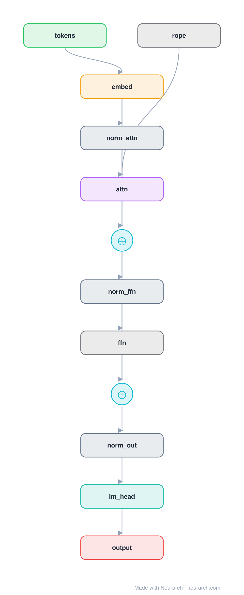

# Phi-3 Mini Block

The Phi-3 Mini (3.8B) decoder block: a compact Llama-style block at 3072 hidden, the architecture behind the "small model trained on textbook-quality data" line of work.

## Model URLs

| Where | URL |
|---|---|
| **Open in Neurarch** (live, editable graph) | https://www.neurarch.com/?import=https://raw.githubusercontent.com/neurarch-ai/awesome-llm-model-zoo/main/architectures/phi3-mini/model.json |
| Paper (Abdin et al. 2024) | https://arxiv.org/abs/2404.14219 |
| Hugging Face | https://huggingface.co/microsoft/Phi-3-mini-4k-instruct |

## Architecture

<b>Layer-by-layer (12 nodes)</b>

| # | Layer | Type | Params |
|---|---|---|---|
| 1 | tokens | `input` | shape: [1, 2048] |
| 2 | embed | `embedding` | numEmbeddings: 32064, embeddingDim: 3072 |
| 3 | rope | `rope` | headDim: 96 |
| 4 | norm_attn | `rmsNorm` | normalizedShape: 3072 |
| 5 | attn | `groupedQueryAttention` | embedDim: 3072, numHeads: 32, numKVHeads: 32 |
| 6 | residual_1 | `add` |   |
| 7 | norm_ffn | `rmsNorm` | normalizedShape: 3072 |
| 8 | ffn | `swiglu` | embedDim: 3072, intermediateSize: 8192 |
| 9 | residual_2 | `add` |   |
| 10 | norm_out | `rmsNorm` | normalizedShape: 3072 |
| 11 | lm_head | `linear` | outFeatures: 32064, inFeatures: 3072 |
| 12 | output | `output` |   |

This graph ships in Neurarch's in-app template library; the copy here passes shape propagation with zero errors.

## Design notes

- Full multi-head attention (32 heads at 3072, head dim 96); no GQA at this scale in the 4k variant.
- SwiGLU FFN at 8192 intermediate, RMSNorm pre-norm, RoPE.
- Architecturally conventional on purpose: the Phi thesis is that data quality, not architecture novelty, drives small-model performance.

## Files

| File | What it is |
|---|---|
| [`model.json`](model.json) | The Neurarch graph. Shape-validated; open it at [neurarch.com](https://www.neurarch.com/) to edit or export training code. |
| [`assets/diagram.svg`](assets/diagram.svg) | Vector diagram (papers, slides). |
| [`assets/diagram.png`](assets/diagram.png) | Raster diagram (renders everywhere). |
