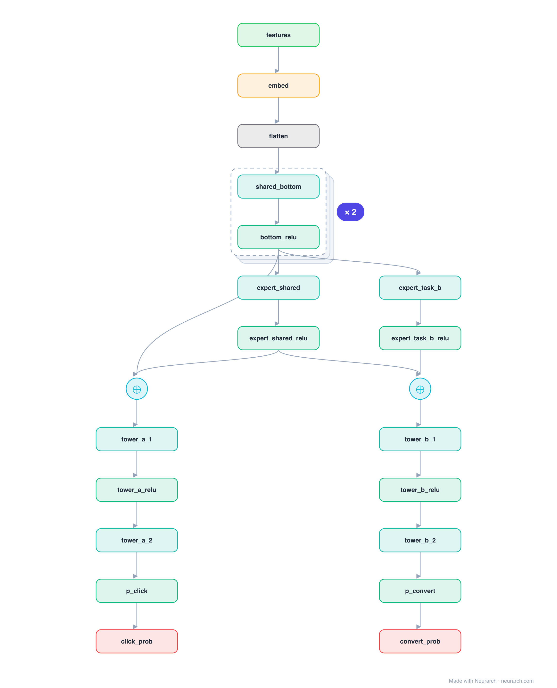

# PLE (CGC)

Progressive Layered Extraction (and its single-level form CGC): splits experts into task-specific groups and a shared group, so each task draws on its own specialists plus the shared pool but never on another task's specialists. Tencent's answer to the "seesaw" effect where improving one task quietly degrades another.

## Model URLs

| Where | URL |
|---|---|
| **Open in Neurarch** (live, editable graph) | https://www.neurarch.com/?import=https://raw.githubusercontent.com/neurarch-ai/awesome-llm-model-zoo/main/architectures/ple/model.json |
| Paper (Tang et al. 2020) | https://dl.acm.org/doi/10.1145/3383313.3412236 |

## Architecture

*Identical repeated blocks are folded into one representative block with a `× N` badge, so the whole architecture fits on screen. `model.json` keeps all 23 nodes (open it in Neurarch to see and edit every layer). Vector: [diagram.svg](assets/diagram.svg).*

| Hyperparameter | Value |
|---|---|
| Type | Multi-task ranking |
| Experts | Task-specific groups plus a shared group |
| Routing | Each task uses its own experts plus shared |
| Towers | One MLP head per objective |
| Key idea | Explicit expert separation cuts negative transfer |

`model.json` is the full graph, hand-built against the official config.json.

## Parameter check

This entry is a **structural reference**: its parameter mix is not recomputed by the per-layer estimator, so it carries no deviation gate. See the hyperparameter table above for the authoritative total / active parameter counts.

## Design notes

- CGC is the single-extraction-layer version; PLE stacks several extraction layers to progressively separate and recombine representations.
- Reference topology: one extraction layer with a task-A expert, a shared expert, and a task-B expert.
- Direct lineage from [mmoe](../mmoe/): same multi-task goal, but explicit expert grouping instead of purely soft gates.

## Files

| File | What it is |
|---|---|
| [`model.json`](model.json) | The full Neurarch graph (every layer, real dimensions). Open it at [neurarch.com](https://www.neurarch.com/) to edit or export training code. |
| [`assets/diagram.svg`](assets/diagram.svg) / [`.png`](assets/diagram.png) | Architecture diagram (repeated blocks folded with a `× N` badge). |
