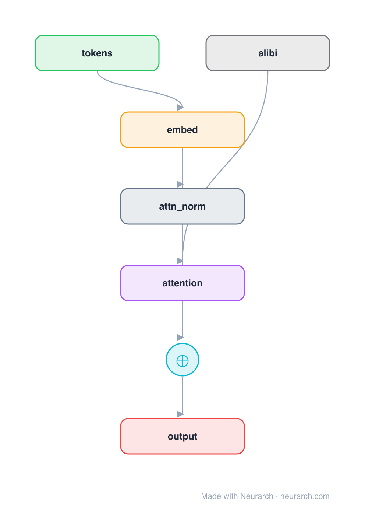

# Linear Bias Positions (ALiBi)

The same minimal decoder block as [posenc-learned](../posenc-learned/), but position is encoded by **ALiBi (Attention with Linear Biases)**: no position embedding at all. A static, per-head linear penalty proportional to the distance between query and key is added to the attention scores, so far-apart tokens are down-weighted. Trains short, extrapolates long. The scheme used by MPT and BLOOM.

**Third of three sibling blocks** (learned → RoPE → ALiBi). Like RoPE, the position signal (`alibi`) feeds **into the attention**, not the residual stream, but it is a bias on scores rather than a rotation of Q/K. See [COMPARISONS.md → Positional encoding](../../COMPARISONS.md#positional-encoding-learned--rope--alibi).

## Model URLs

| Where | URL |
|---|---|
| **Open in Neurarch** (live, editable graph) | https://www.neurarch.com/?import=https://raw.githubusercontent.com/neurarch-ai/awesome-llm-model-zoo/main/architectures/posenc-alibi/model.json |
| Paper (ALiBi, Press et al. 2021) | https://arxiv.org/abs/2108.12409 |

## Architecture

<b>Layer-by-layer (7 nodes)</b>

| # | Layer | Type | Params |
|---|---|---|---|
| 1 | tokens | `input` | shape: [1, 128] |
| 2 | embed | `embedding` | numEmbeddings: 32000, embeddingDim: 512 |
| 3 | attn_norm | `layerNorm` | normalizedShape: 512 |
| 4 | alibi | `alibi` | numHeads: 8 |
| 5 | attention | `multiHeadAttention` | embedDim: 512, numHeads: 8 |
| 6 | residual | `add` |   |
| 7 | output | `output` |   |

Shape-validated end to end (passes Neurarch's shape propagation with zero errors).

## Design notes

- Zero learned position parameters: the `alibi` node adds a fixed distance penalty to attention scores, one slope per head (hence `numHeads`).
- The penalty is computed at attention time, so the trained context length is not a hard ceiling, ALiBi's headline property is clean extrapolation to sequences longer than it ever saw.
- Same wiring slot as [posenc-rope](../posenc-rope/) (side input to attention), different mechanism: a bias on scores vs. a rotation of Q/K. The [comparison](../../COMPARISONS.md#positional-encoding-learned--rope--alibi) puts the three side by side.

## Files

| File | What it is |
|---|---|
| [`model.json`](model.json) | The Neurarch graph. Shape-validated; open it at [neurarch.com](https://www.neurarch.com/) to edit or export training code. |
| [`assets/diagram.svg`](assets/diagram.svg) | Vector diagram (papers, slides). |
| [`assets/diagram.png`](assets/diagram.png) | Raster diagram (renders everywhere). |
