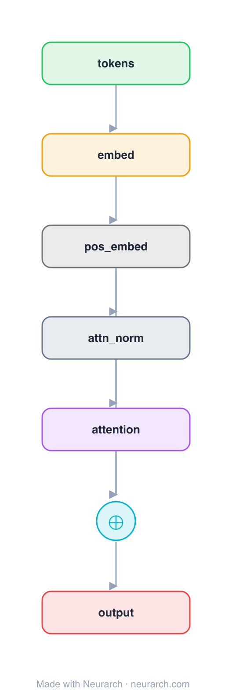

# Learned Absolute Positions

A minimal decoder attention block where position information comes from a **learned absolute position embedding** added to the token embeddings. One trainable vector per position, summed into the input before attention. The scheme used by the original GPT and BERT.

**First of three sibling blocks** showing how position is injected: learned → RoPE → ALiBi. The graph diff is the whole point, here the position signal is a visible node in the main path (`pos_embed`) and attention itself is plain. See [COMPARISONS.md → Positional encoding](../../COMPARISONS.md#positional-encoding-learned--rope--alibi).

## Model URLs

| Where | URL |
|---|---|
| **Open in Neurarch** (live, editable graph) | https://www.neurarch.com/?import=https://raw.githubusercontent.com/neurarch-ai/awesome-llm-model-zoo/main/architectures/posenc-learned/model.json |
| Paper (BERT, Devlin et al. 2018) | https://arxiv.org/abs/1810.04805 |

## Architecture

<b>Layer-by-layer (7 nodes)</b>

| # | Layer | Type | Params |
|---|---|---|---|
| 1 | tokens | `input` | shape: [1, 128] |
| 2 | embed | `embedding` | numEmbeddings: 32000, embeddingDim: 512 |
| 3 | pos_embed | `learnedPositionalEmbedding` | maxLen: 512, embedDim: 512 |
| 4 | attn_norm | `layerNorm` | normalizedShape: 512 |
| 5 | attention | `multiHeadAttention` | embedDim: 512, numHeads: 8 |
| 6 | residual | `add` |   |
| 7 | output | `output` |   |

Shape-validated end to end (passes Neurarch's shape propagation with zero errors).

## Design notes

- Position lives in the **main path**: a `maxLen × embedDim` table added to the token embeddings, so attention needs no positional input.
- Trainable and simple, but capped at `maxLen` positions, this is the variant that does not extrapolate past its trained length, which is what motivated RoPE and ALiBi.
- Contrast with the [siblings](../../COMPARISONS.md#positional-encoding-learned--rope--alibi): in [posenc-rope](../posenc-rope/) and [posenc-alibi](../posenc-alibi/) the position node feeds the attention op instead of the residual stream.

## Files

| File | What it is |
|---|---|
| [`model.json`](model.json) | The Neurarch graph. Shape-validated; open it at [neurarch.com](https://www.neurarch.com/) to edit or export training code. |
| [`assets/diagram.svg`](assets/diagram.svg) | Vector diagram (papers, slides). |
| [`assets/diagram.png`](assets/diagram.png) | Raster diagram (renders everywhere). |
