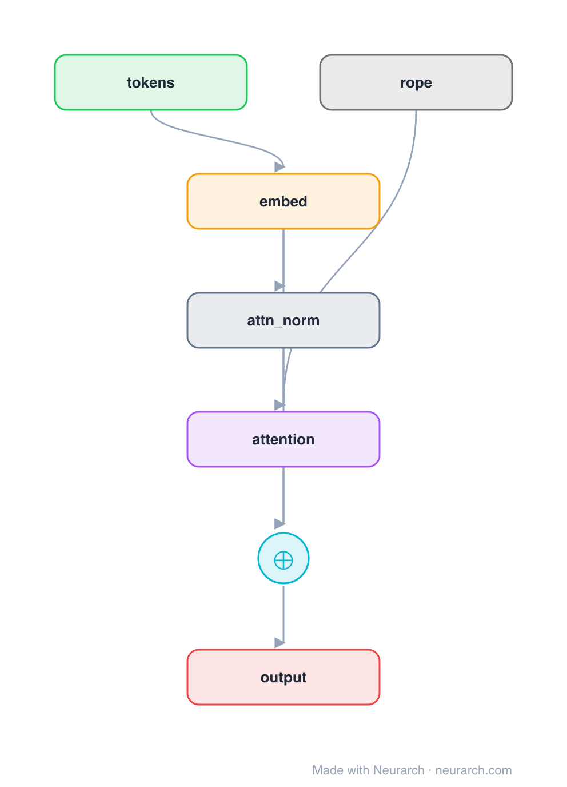

# Rotary Positions (RoPE)

The same minimal decoder block as [posenc-learned](../posenc-learned/), but position is encoded by **rotary embeddings (RoPE)**: instead of adding a position vector, the query/key vectors are *rotated* by an angle that depends on position, inside the attention op. Relative position falls out of the dot product, and it extrapolates far better than a learned table. The scheme used by Llama, Qwen, Mistral, and most modern decoders.

**Second of three sibling blocks** (learned → RoPE → ALiBi). Here the position signal is a `rope` node wired **into the attention** as a side input, not into the residual stream. See [COMPARISONS.md → Positional encoding](../../COMPARISONS.md#positional-encoding-learned--rope--alibi).

## Model URLs

| Where | URL |
|---|---|
| **Open in Neurarch** (live, editable graph) | https://www.neurarch.com/?import=https://raw.githubusercontent.com/neurarch-ai/awesome-llm-model-zoo/main/architectures/posenc-rope/model.json |
| Paper (RoFormer / RoPE, Su et al. 2021) | https://arxiv.org/abs/2104.09864 |

## Architecture

<b>Layer-by-layer (7 nodes)</b>

| # | Layer | Type | Params |
|---|---|---|---|
| 1 | tokens | `input` | shape: [1, 128] |
| 2 | embed | `embedding` | numEmbeddings: 32000, embeddingDim: 512 |
| 3 | attn_norm | `layerNorm` | normalizedShape: 512 |
| 4 | rope | `rope` | dim: 64, maxSeqLen: 2048 |
| 5 | attention | `multiHeadAttention` | embedDim: 512, numHeads: 8 |
| 6 | residual | `add` |   |
| 7 | output | `output` |   |

Shape-validated end to end (passes Neurarch's shape propagation with zero errors).

## Design notes

- No vector is added to the embeddings: the `rope` node rotates Q/K **inside attention**, so the position signal is a side input to node 5, not a main-path add.
- `dim` is the per-head rotation dimension (here headDim = 512 / 8 = 64); `maxSeqLen` sets the frequency base. Tweaking these (NTK / YaRN scaling) is how RoPE models extend context after training.
- Encodes *relative* position, which is why it extrapolates past `maxSeqLen` far better than [learned absolute](../posenc-learned/) positions.

## Files

| File | What it is |
|---|---|
| [`model.json`](model.json) | The Neurarch graph. Shape-validated; open it at [neurarch.com](https://www.neurarch.com/) to edit or export training code. |
| [`assets/diagram.svg`](assets/diagram.svg) | Vector diagram (papers, slides). |
| [`assets/diagram.png`](assets/diagram.png) | Raster diagram (renders everywhere). |
