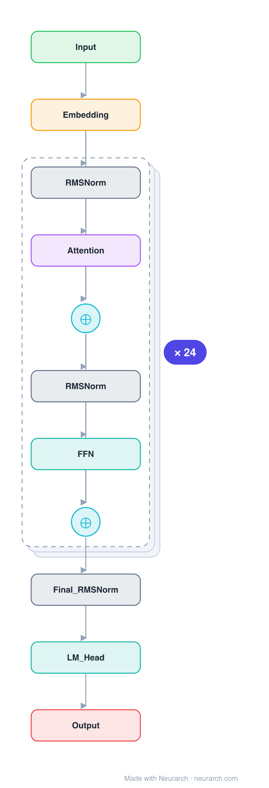

# Pythia-1.4B

One rung of EleutherAI's Pythia suite, the interpretability-and-training-dynamics workhorse: an identical GPT-NeoX architecture trained at 8 sizes on the exact same data order, with 154 checkpoints each. The 1.4B is the popular mid-size.

## Model URLs

| Where | URL |
|---|---|
| **Open in Neurarch** (live, editable graph) | https://www.neurarch.com/?import=https://raw.githubusercontent.com/neurarch-ai/awesome-llm-model-zoo/main/architectures/pythia-1.4b/model.json |
| Paper (Biderman et al. 2023) | https://arxiv.org/abs/2304.01373 |
| Hugging Face | https://huggingface.co/EleutherAI/pythia-1.4b |
| GitHub | https://github.com/EleutherAI/pythia |

## Architecture

*Identical repeated blocks are folded into one representative block with a `× N` badge, so the whole architecture fits on screen. `model.json` keeps all 149 nodes (open it in Neurarch to see and edit every layer). Vector: [diagram.svg](assets/diagram.svg).*

| Hyperparameter | Value |
|---|---|
| Type | Decoder-only transformer (causal LM) |
| Parameters | 1.4B |
| Layers | 24 |
| Hidden size | 2048 |
| Attention | Multi-head: 16 heads, head dim 128 |
| Block | Parallel residual (GPT-NeoX) |
| FFN | Dense MLP, 8192, GeLU |
| Normalization | LayerNorm, pre-norm |
| Positions | RoPE (full) |
| Vocabulary | 50,304 |
| Max context | 2,048 |

`model.json` is the full graph, produced with the same import path the Neurarch app uses for "load from Hugging Face".

## Parameter check

Neurarch's per-layer parameter estimate over this graph: **1.41B**.
Hugging Face safetensors metadata reports **1.52B** for the real weights.
Deviation from the authoritative count (1.52B): **-6.6%**.

## Design notes

- GPT-NeoX parallel-residual block: attention and MLP both consume the same normed input and sum into the residual.
- Full RoPE on 128-dim heads; untied embeddings; 50304-token GPT-NeoX BPE vocabulary (padded for efficiency).
- The value is the controlled suite, not the architecture: same data, same order, every size and checkpoint released, so you can study how a fixed architecture learns.

## Files

| File | What it is |
|---|---|
| [`model.json`](model.json) | The full Neurarch graph (every layer, real dimensions). Open it at [neurarch.com](https://www.neurarch.com/) to edit or export training code. |
| [`assets/diagram.svg`](assets/diagram.svg) / [`.png`](assets/diagram.png) | Architecture diagram (repeated blocks folded with a `× N` badge). |

**License:** Apache 2.0. The graph and diagrams here describe the architecture; any referenced weights remain under the upstream license.
