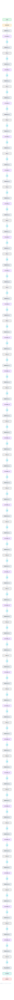

# Qwen2.5-7B

A 7.6B-parameter decoder-only transformer from the Qwen2.5 family, one of the most widely deployed open-weight Chinese and multilingual LLM series. Llama-style pre-norm decoder with grouped-query attention, RoPE, RMSNorm, and SwiGLU.

## Model URLs

| Where | URL |
|---|---|
| **Open in Neurarch** (live, editable graph) | https://www.neurarch.com/?import=https://raw.githubusercontent.com/neurarch-ai/neurarch-model-zoo/main/architectures/qwen2.5-7b/model.json |
| Hugging Face | https://huggingface.co/Qwen/Qwen2.5-7B |
| GitHub | https://github.com/QwenLM/Qwen2.5 |

## Architecture

| Hyperparameter | Value |
|---|---|
| Type | Decoder-only transformer (causal LM) |
| Parameters | 7.6B |
| Layers | 28 |
| Hidden size | 3584 |
| Attention | Grouped-query: 28 query heads, 4 KV heads |
| Head dim | 128 |
| FFN | SwiGLU, intermediate size 18,944 |
| Normalization | RMSNorm, pre-norm |
| Positions | RoPE (rotary dim 128) |
| Vocabulary | 152,064 |
| Max context | 131,072 |

The diagram and `model.json` show the full forward path with one of the 28 identical decoder blocks expanded (the stack repeats x28). All hyperparameters are taken from the official `config.json` on Hugging Face.

## Design notes

- Grouped-query attention with 28 query heads sharing 4 KV heads (7:1 ratio), which keeps the KV cache small at long context.
- Unusually for the Llama lineage, Qwen adds a bias term to the Q, K, V projections (attention bias on, everywhere else off).
- Wide FFN: the SwiGLU intermediate size (18944) is about 5.3x the hidden size, wider than the Llama-2 ratio.
- Native 131072-token context window with rope_theta = 1e6.

## Files

| File | What it is |
|---|---|
| [`model.json`](model.json) | The Neurarch graph. Shape-validated; open it at [neurarch.com](https://www.neurarch.com/) to edit or export training code. |
| [`assets/diagram.svg`](assets/diagram.svg) | Vector diagram (papers, slides). |
| [`assets/diagram.png`](assets/diagram.png) | Raster diagram (renders everywhere). |

**License:** Apache 2.0. The graph and diagrams here describe the architecture; the model weights remain under the upstream license.
