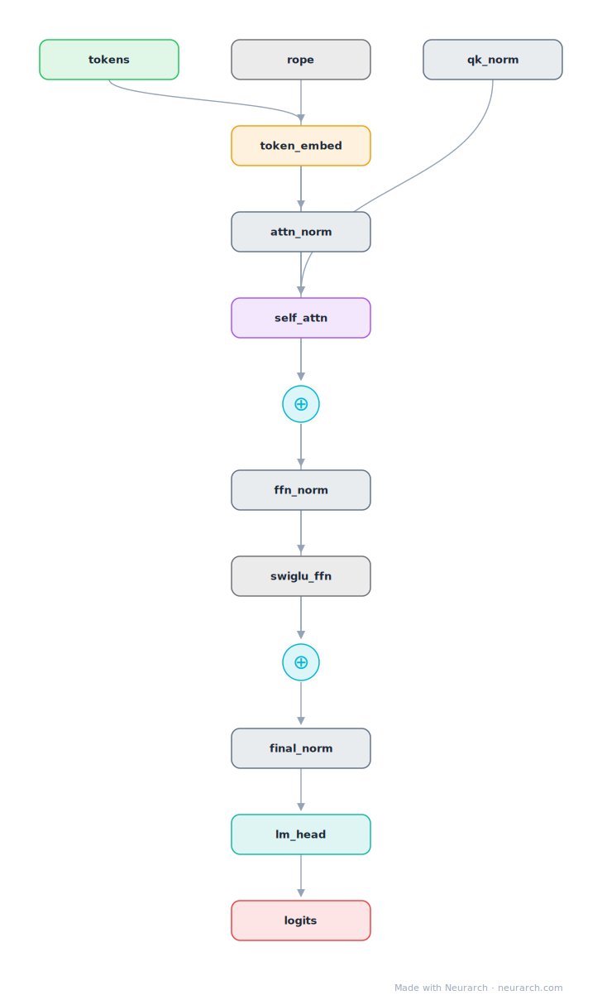

# Qwen3-8B

The dense 8B from the Qwen3 generation, the default open model of 2025 by download count. Architecturally a cleanup: QKV bias out, QK-Norm in, more depth per parameter.

## Model URLs

| Where | URL |
|---|---|
| **Open in Neurarch** (live, editable graph) | https://www.neurarch.com/?import=https://raw.githubusercontent.com/neurarch-ai/neurarch-model-zoo/main/architectures/qwen3-8b/model.json |
| Hugging Face | https://huggingface.co/Qwen/Qwen3-8B |
| GitHub | https://github.com/QwenLM/Qwen3 |

## Architecture

*Compact view: one block expanded. The full graph below is what `model.json` holds.*

<b>Full graph: 221 nodes (click to expand)</b>

| Hyperparameter | Value |
|---|---|
| Type | Decoder-only transformer (causal LM) |
| Parameters | 8.2B |
| Layers | 36 |
| Hidden size | 4096 |
| Attention | Grouped-query: 32 query heads, 8 KV heads, QK-Norm |
| Head dim | 128 |
| FFN | SwiGLU, intermediate size 12,288 |
| Normalization | RMSNorm, pre-norm |
| Positions | RoPE (rotary dim 128) |
| Vocabulary | 151,936 |
| Max context | 40,960 |

`model.json` is the full 36-layer graph, produced with the same import path the Neurarch app uses for "load from Hugging Face", with all hyperparameters from the official `config.json`.

## Parameter check

Neurarch's per-layer parameter estimate over this graph: **8.19B**.
Hugging Face safetensors metadata reports **8.19B** for the real weights.
Deviation from the authoritative count (8.19B): **+0.0%**.

## Design notes

- QK-Norm replaces the Qwen2.5 QKV bias: per-head RMSNorm on queries and keys before RoPE (attention_bias is false in the config), trading the bias trick for norm-based attention stability.
- Deeper and thinner than Qwen2.5-7B: 36 layers at 4096 hidden versus 28 at 3584, with a narrower 12288 FFN.
- GQA 32:8 with explicit head_dim 128; native 40960-token context at rope_theta 1e6.
- The dense workhorse of the Qwen3 release; the same recipe scales to the 235B-A22B MoE flagship. Hybrid thinking/non-thinking modes are a training-time property, not an architecture change.

## Files

| File | What it is |
|---|---|
| [`model.json`](model.json) | The full Neurarch graph (every layer, real dimensions). Open it at [neurarch.com](https://www.neurarch.com/) to edit or export training code. |
| [`assets/diagram.svg`](assets/diagram.svg) / [`.png`](assets/diagram.png) | Diagram of the full graph. |
| [`assets/block.svg`](assets/block.svg) / [`.png`](assets/block.png) | Compact one-block explainer view. |

**License:** Apache 2.0. The graph and diagrams here describe the architecture; the model weights remain under the upstream license.
