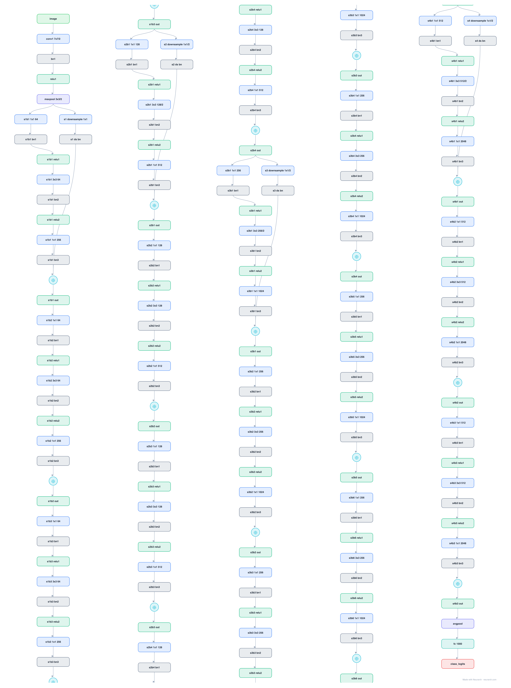
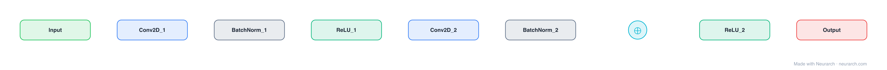

# ResNet-50

The most-cited convolutional network ever and the ILSVRC 2015 winner. This is the full graph: conv stem, all 16 bottleneck residual blocks (3+4+6+3) with every conv, batch norm, and skip connection, global average pooling, and the 1000-way head.

## Model URLs

| Where | URL |
|---|---|
| **Open in Neurarch** (live, editable graph) | https://www.neurarch.com/?import=https://raw.githubusercontent.com/neurarch-ai/neurarch-model-zoo/main/architectures/resnet-50/model.json |
| Paper (He et al. 2015) | https://arxiv.org/abs/1512.03385 |
| Hugging Face | https://huggingface.co/microsoft/resnet-50 |

## Architecture

*The full graph, all 176 nodes, tiled into columns for readability (read each column top-to-bottom, then left-to-right). Exactly what `model.json` holds. Vector: [diagram.svg](assets/diagram.svg).*

<b>One block, expanded (explainer view)</b>

| Hyperparameter | Value |
|---|---|
| Type | Convolutional network (image classification) |
| Parameters | 25.6M |
| Stem | 7x7/2 conv (64) + 3x3/2 max-pool |
| Stages | 4 stages of bottleneck blocks: 3, 4, 6, 3 |
| Bottleneck | 1x1 reduce, 3x3, 1x1 expand (4x) |
| Channels | 256 / 512 / 1024 / 2048 per stage |
| Shortcuts | Identity; 1x1 projection at stage boundaries |
| Head | Global average pool + FC-1000 |
| Input | 3x224x224 |

`model.json` is the full graph, hand-built against the official config.json.

## Parameter check

Neurarch's per-layer parameter estimate over this graph: **25.6M**.
Deviation from the authoritative count (25.6M): **-0.1%**.

## Design notes

- Bottleneck design: 1x1 reduce, 3x3 conv, 1x1 expand in every block, which is how 50 layers stay at 25.6M parameters.
- Stage transitions double channels and halve resolution with strided 1x1 projections on the skip path.
- A decade later it is still the default vision backbone for detection, segmentation, and as a sanity-check baseline.

## Files

| File | What it is |
|---|---|
| [`model.json`](model.json) | The full Neurarch graph (every layer, real dimensions). Open it at [neurarch.com](https://www.neurarch.com/) to edit or export training code. |
| [`assets/diagram.svg`](assets/diagram.svg) / [`.png`](assets/diagram.png) | Diagram of the full graph. |
| [`assets/block.svg`](assets/block.svg) / [`.png`](assets/block.png) | Compact one-block explainer view. |

**License:** Apache 2.0 (HF weights). The graph and diagrams here describe the architecture; any referenced weights remain under the upstream license.
