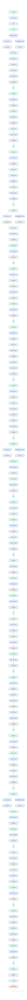

# ResNet-50

The most-cited convolutional network ever and the ILSVRC 2015 winner. This is the full 50-layer graph: conv stem, four stages of bottleneck residual blocks (3, 4, 6, 3), global average pooling, and the 1000-way head.

## Model URLs

| Where | URL |
|---|---|
| **Open in Neurarch** (live, editable graph) | https://www.neurarch.com/?import=https://raw.githubusercontent.com/neurarch-ai/neurarch-model-zoo/main/architectures/resnet-50/model.json |
| Paper (He et al. 2015) | https://arxiv.org/abs/1512.03385 |
| Hugging Face | https://huggingface.co/microsoft/resnet-50 |

## Architecture

<b>Layer-by-layer (50 nodes)</b>

| # | Layer | Type | Params |
|---|---|---|---|
| 1 | Input | `input` | shape: [3, 224, 224] |
| 2 | Conv1 7×7/2 | `conv2d` | outChannels: 64, kernelSize: 7, stride: 2, padding: 3 |
| 3 | BN | `batchNorm` |   |
| 4 | ReLU | `relu` |   |
| 5 | MaxPool 3×3/2 | `maxpool2d` | kernelSize: 3, stride: 2 |
| 6 | Conv1×1 (64) | `conv2d` | outChannels: 64, kernelSize: 1, stride: 1, padding: 0 |
| 7 | BN | `batchNorm` |   |
| 8 | ReLU | `relu` |   |
| 9 | Conv3×3 (64) | `conv2d` | outChannels: 64, kernelSize: 3, stride: 1, padding: 1 |
| 10 | BN | `batchNorm` |   |
| 11 | ReLU | `relu` |   |
| 12 | Conv1×1 (256) | `conv2d` | outChannels: 256, kernelSize: 1, stride: 1, padding: 0 |
| 13 | BN | `batchNorm` |   |
| 14 | Add (residual) | `add` |   |
| 15 | ReLU | `relu` |   |
| 16 | Conv1×1 (128) | `conv2d` | outChannels: 128, kernelSize: 1, stride: 1, padding: 0 |
| 17 | BN | `batchNorm` |   |
| 18 | ReLU | `relu` |   |
| 19 | Conv3×3 (128) | `conv2d` | outChannels: 128, kernelSize: 3, stride: 1, padding: 1 |
| 20 | BN | `batchNorm` |   |
| 21 | ReLU | `relu` |   |
| 22 | Conv1×1 (512) | `conv2d` | outChannels: 512, kernelSize: 1, stride: 1, padding: 0 |
| 23 | BN | `batchNorm` |   |
| 24 | Add (residual) | `add` |   |
| 25 | ReLU | `relu` |   |
| 26 | Conv1×1 (256) | `conv2d` | outChannels: 256, kernelSize: 1, stride: 1, padding: 0 |
| 27 | BN | `batchNorm` |   |
| 28 | ReLU | `relu` |   |
| 29 | Conv3×3 (256) | `conv2d` | outChannels: 256, kernelSize: 3, stride: 1, padding: 1 |
| 30 | BN | `batchNorm` |   |
| 31 | ReLU | `relu` |   |
| 32 | Conv1×1 (1024) | `conv2d` | outChannels: 1024, kernelSize: 1, stride: 1, padding: 0 |
| 33 | BN | `batchNorm` |   |
| 34 | Add (residual) | `add` |   |
| 35 | ReLU | `relu` |   |
| 36 | Conv1×1 (512) | `conv2d` | outChannels: 512, kernelSize: 1, stride: 1, padding: 0 |
| 37 | BN | `batchNorm` |   |
| 38 | ReLU | `relu` |   |
| 39 | Conv3×3 (512) | `conv2d` | outChannels: 512, kernelSize: 3, stride: 1, padding: 1 |
| 40 | BN | `batchNorm` |   |
| 41 | ReLU | `relu` |   |
| 42 | Conv1×1 (2048) | `conv2d` | outChannels: 2048, kernelSize: 1, stride: 1, padding: 0 |
| 43 | BN | `batchNorm` |   |
| 44 | Add (residual) | `add` |   |
| 45 | ReLU | `relu` |   |
| 46 | GlobalAvgPool | `globalAvgPool2d` |   |
| 47 | Flatten | `flatten` |   |
| 48 | FC (1000) | `linear` | outFeatures: 1000 |
| 49 | Softmax | `softmax` | dim: -1 |
| 50 | Output | `output` |   |

This graph is generated by Neurarch's architecture parser and passes shape propagation with zero errors.

## Design notes

- Bottleneck design: 1x1 reduce, 3x3 conv, 1x1 expand in every block, which is how 50 layers stay at 25.6M parameters.
- Stage transitions double channels and halve resolution with strided 1x1 projections on the skip path.
- A decade later it is still the default vision backbone for detection, segmentation, and as a sanity-check baseline.

## Files

| File | What it is |
|---|---|
| [`model.json`](model.json) | The Neurarch graph. Shape-validated; open it at [neurarch.com](https://www.neurarch.com/) to edit or export training code. |
| [`assets/diagram.svg`](assets/diagram.svg) | Vector diagram (papers, slides). |
| [`assets/diagram.png`](assets/diagram.png) | Raster diagram (renders everywhere). |

**License:** Apache 2.0 (HF weights). The graph and diagrams here describe the architecture; any referenced weights remain under the upstream license.
