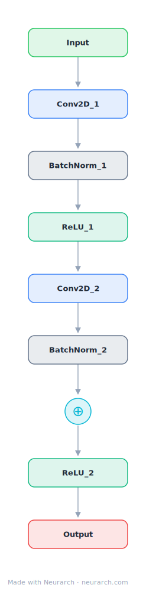

# ResNet Residual Block

The residual unit from ResNet: conv-BN-ReLU twice, plus the identity skip connection that made 100+ layer networks trainable. Arguably the most influential 9 nodes in deep learning.

## Model URLs

| Where | URL |
|---|---|
| **Open in Neurarch** (live, editable graph) | https://www.neurarch.com/?import=https://raw.githubusercontent.com/neurarch-ai/neurarch-model-zoo/main/architectures/resnet-block/model.json |
| Paper (He et al. 2015) | https://arxiv.org/abs/1512.03385 |

## Architecture

<b>Layer-by-layer (9 nodes)</b>

| # | Layer | Type | Params |
|---|---|---|---|
| 1 | Input | `input` | shape: [64, 32, 32] |
| 2 | Conv2D_1 | `conv2d` | outChannels: 64, kernelSize: 3, stride: 1, padding: 1 |
| 3 | BatchNorm_1 | `batchNorm` |   |
| 4 | ReLU_1 | `relu` |   |
| 5 | Conv2D_2 | `conv2d` | outChannels: 64, kernelSize: 3, stride: 1, padding: 1 |
| 6 | BatchNorm_2 | `batchNorm` |   |
| 7 | Add | `add` |   |
| 8 | ReLU_2 | `relu` |   |
| 9 | Output | `output` |   |

This graph ships in Neurarch's in-app template library; the copy here passes shape propagation with zero errors.

## Design notes

- The skip connection turns layers into residual functions; every modern transformer residual stream descends from this idea.
- Companion to the full [resnet-50](../resnet-50/) entry, which stacks bottleneck versions of this block 16 times.

## Files

| File | What it is |
|---|---|
| [`model.json`](model.json) | The Neurarch graph. Shape-validated; open it at [neurarch.com](https://www.neurarch.com/) to edit or export training code. |
| [`assets/diagram.svg`](assets/diagram.svg) | Vector diagram (papers, slides). |
| [`assets/diagram.png`](assets/diagram.png) | Raster diagram (renders everywhere). |
