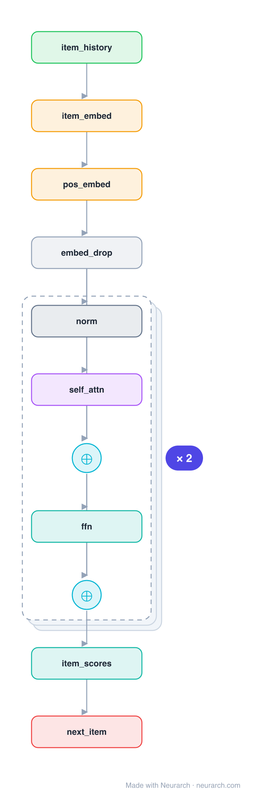

# SASRec

Self-Attentive Sequential Recommendation: a causal Transformer over the user's item history that predicts the next item, GPT for recommendation. One of the most-cited and most-reimplemented sequential-recsys baselines.

## Model URLs

| Where | URL |
|---|---|
| **Open in Neurarch** (live, editable graph) | https://www.neurarch.com/?import=https://raw.githubusercontent.com/neurarch-ai/awesome-llm-model-zoo/main/architectures/sasrec/model.json |
| Paper (Kang and McAuley 2018) | https://arxiv.org/abs/1808.09781 |

## Architecture

*Identical repeated blocks are folded into one representative block with a `× N` badge, so the whole architecture fits on screen. `model.json` keeps all 16 nodes (open it in Neurarch to see and edit every layer). Vector: [diagram.svg](assets/diagram.svg).*

| Hyperparameter | Value |
|---|---|
| Type | Sequential recommendation |
| Embedding | Item + learned positional |
| Backbone | Causal (left-to-right) self-attention blocks |
| Objective | Next-item prediction |
| Key idea | Self-attention over history, GPT-style |

`model.json` is the full graph, hand-built against the official config.json.

## Parameter check

Neurarch's per-layer parameter estimate over this graph: **6.5M**.

## Design notes

- Causal self-attention means position t attends only to items up to t, exactly like a language-model decoder.
- Adaptively weights which past items matter for the next click, instead of the fixed recency bias of an RNN.
- Pairs with [bert4rec](../bert4rec/): same item-sequence setup, causal (SASRec) vs bidirectional masked (BERT4Rec).

## Files

| File | What it is |
|---|---|
| [`model.json`](model.json) | The full Neurarch graph (every layer, real dimensions). Open it at [neurarch.com](https://www.neurarch.com/) to edit or export training code. |
| [`assets/diagram.svg`](assets/diagram.svg) / [`.png`](assets/diagram.png) | Architecture diagram (repeated blocks folded with a `× N` badge). |
