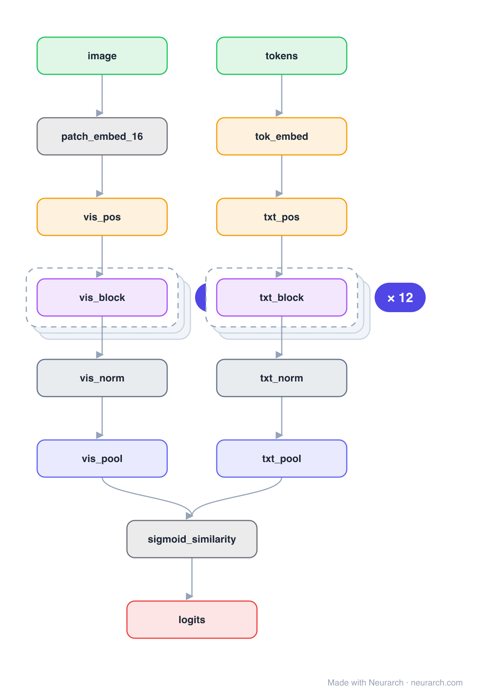

# SigLIP base

CLIP with one change that matters: a pairwise sigmoid loss instead of the softmax-contrastive one. Dropping the batch-global normalization lets it train well at any batch size, and its vision tower is the encoder many 2024+ multimodal LLMs (including PaliGemma) build on.

## Model URLs

| Where | URL |
|---|---|
| **Open in Neurarch** (live, editable graph) | https://www.neurarch.com/?import=https://raw.githubusercontent.com/neurarch-ai/awesome-llm-model-zoo/main/architectures/siglip-base/model.json |
| Paper (Zhai et al. 2023) | https://arxiv.org/abs/2303.15343 |
| Hugging Face | https://huggingface.co/google/siglip-base-patch16-224 |

## Architecture

*Identical repeated blocks are folded into one representative block with a `× N` badge, so the whole architecture fits on screen. `model.json` keeps all 36 nodes (open it in Neurarch to see and edit every layer). Vector: [diagram.svg](assets/diagram.svg).*

| Hyperparameter | Value |
|---|---|
| Type | Contrastive image-text dual encoder |
| Parameters | 203M |
| Vision tower | ViT-B/16: 12 blocks, 768 hidden, 12 heads |
| Text tower | 12 blocks, 768 hidden (no causal mask) |
| Loss | Pairwise sigmoid (not softmax contrastive) |
| Pooling | Attention/mean pool per tower |

`model.json` is the full graph, hand-built against the official config.json.

## Parameter check

Neurarch's per-layer parameter estimate over this graph: **195.3M**.

## Design notes

- The architecture is a CLIP-style dual encoder; the contribution is the sigmoid loss, which treats every image-text pair as an independent binary problem.
- No softmax over the batch means no need for the huge batches CLIP relied on, and the text tower drops the causal mask CLIP inherited from GPT.
- Compare with [clip-vit-b32](../clip-vit-b32/): same two-tower shape, different objective.

## Files

| File | What it is |
|---|---|
| [`model.json`](model.json) | The full Neurarch graph (every layer, real dimensions). Open it at [neurarch.com](https://www.neurarch.com/) to edit or export training code. |
| [`assets/diagram.svg`](assets/diagram.svg) / [`.png`](assets/diagram.png) | Architecture diagram (repeated blocks folded with a `× N` badge). |

**License:** Apache 2.0. The graph and diagrams here describe the architecture; any referenced weights remain under the upstream license.
