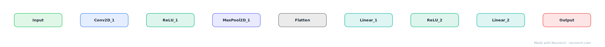

# Simple CNN

A LeNet-style starter CNN for image classification: conv-pool stacks into a dense head. The "hello world" graph of computer vision.

## Model URLs

| Where | URL |
|---|---|
| **Open in Neurarch** (live, editable graph) | https://www.neurarch.com/?import=https://raw.githubusercontent.com/neurarch-ai/neurarch-model-zoo/main/architectures/simple-cnn/model.json |
| Paper (LeCun et al. 1998, LeNet) | https://ieeexplore.ieee.org/document/726791 |

## Architecture

<b>Layer-by-layer (9 nodes)</b>

| # | Layer | Type | Params |
|---|---|---|---|
| 1 | Input | `input` | shape: [1, 28, 28] |
| 2 | Conv2D_1 | `conv2d` | outChannels: 32, kernelSize: 3, stride: 1, padding: 1 |
| 3 | ReLU_1 | `relu` |   |
| 4 | MaxPool2D_1 | `maxpool2d` | kernelSize: 2, stride: 2 |
| 5 | Flatten | `flatten` |   |
| 6 | Linear_1 | `linear` | outFeatures: 128 |
| 7 | ReLU_2 | `relu` |   |
| 8 | Linear_2 | `linear` | outFeatures: 10 |
| 9 | Output | `output` |   |

This graph ships in Neurarch's in-app template library; the copy here passes shape propagation with zero errors.

## Design notes

- The pattern (convolution for local features, pooling for downsampling, dense layers for classification) is unchanged since 1998.
- Good first graph for watching shape propagation catch kernel/stride mistakes.

## Files

| File | What it is |
|---|---|
| [`model.json`](model.json) | The Neurarch graph. Shape-validated; open it at [neurarch.com](https://www.neurarch.com/) to edit or export training code. |
| [`assets/diagram.svg`](assets/diagram.svg) | Vector diagram (papers, slides). |
| [`assets/diagram.png`](assets/diagram.png) | Raster diagram (renders everywhere). |
