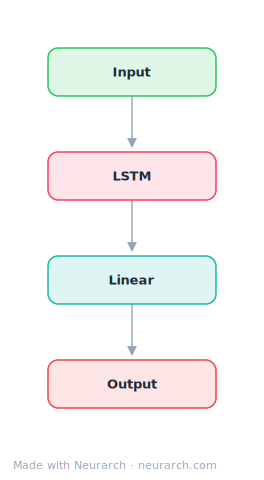

# Simple RNN

A minimal Elman-style recurrent network for sequence processing. Four nodes: the smallest sequential model in the zoo, kept as a teaching baseline.

## Model URLs

| Where | URL |
|---|---|
| **Open in Neurarch** (live, editable graph) | https://www.neurarch.com/?import=https://raw.githubusercontent.com/neurarch-ai/neurarch-model-zoo/main/architectures/simple-rnn/model.json |
| Paper (Elman 1990, Finding Structure in Time) | https://onlinelibrary.wiley.com/doi/10.1207/s15516709cog1402_1 |

## Architecture

<b>Layer-by-layer (4 nodes)</b>

| # | Layer | Type | Params |
|---|---|---|---|
| 1 | Input | `input` | shape: [128, 300] |
| 2 | LSTM | `lstm` | hiddenSize: 256, numLayers: 2 |
| 3 | Linear | `linear` | outFeatures: 10 |
| 4 | Output | `output` |   |

This graph ships in Neurarch's in-app template library; the copy here passes shape propagation with zero errors.

## Design notes

- The architecture every LSTM, GRU, and ultimately attention mechanism was reacting to.
- Useful as a first graph for learning the canvas: add layers, watch shapes propagate.

## Files

| File | What it is |
|---|---|
| [`model.json`](model.json) | The Neurarch graph. Shape-validated; open it at [neurarch.com](https://www.neurarch.com/) to edit or export training code. |
| [`assets/diagram.svg`](assets/diagram.svg) | Vector diagram (papers, slides). |
| [`assets/diagram.png`](assets/diagram.png) | Raster diagram (renders everywhere). |
