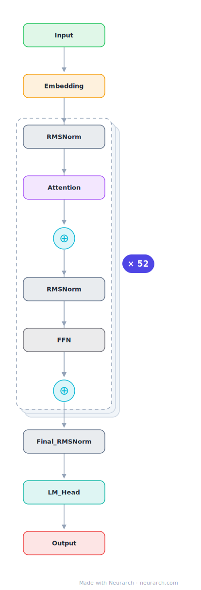

# Skywork-13B

Kunlun Tech's 13B bilingual base model, notable for an explicitly ablated deep-and-thin layout (52 layers) and a thorough public tech report on its 3.2T-token training run.

## Model URLs

| Where | URL |
|---|---|
| **Open in Neurarch** (live, editable graph) | https://www.neurarch.com/?import=https://raw.githubusercontent.com/neurarch-ai/neurarch-model-zoo/main/architectures/skywork-13b/model.json |
| Hugging Face | https://huggingface.co/Skywork/Skywork-13B-base |
| GitHub | https://github.com/SkyworkAI/Skywork |

## Architecture

| Hyperparameter | Value |
|---|---|
| Type | Decoder-only transformer (causal LM) |
| Parameters | 13B |
| Layers | 52 |
| Hidden size | 4608 |
| Attention | Multi-head: 36 heads |
| Head dim | 128 |
| FFN | SwiGLU, intermediate size 12,288 |
| Normalization | RMSNorm, pre-norm |
| Positions | RoPE (rotary dim 128) |
| Vocabulary | 65,519 |
| Max context | 4,096 |

The diagram and `model.json` show the full forward path with one of the 52 identical decoder blocks expanded (the stack repeats x52). All hyperparameters are taken from the official `config.json` on Hugging Face.

## Design notes

- Deliberately deep-and-thin at 13B scale: 52 layers at 4608 hidden, versus Llama-2-13B's 40 layers at 5120. The tech report (arXiv 2310.19341) ablates this choice directly.
- Plain multi-head attention (36 heads), RoPE, RMSNorm, SwiGLU; the FFN ratio is a modest 2.67x.
- 65519-token vocabulary balanced for Chinese and English; trained on 3.2T tokens.
- Ships with a clean tech report and intermediate checkpoints, making it a good reference for training-dynamics work.

## Files

| File | What it is |
|---|---|
| [`model.json`](model.json) | The Neurarch graph. Shape-validated; open it at [neurarch.com](https://www.neurarch.com/) to edit or export training code. |
| [`assets/diagram.svg`](assets/diagram.svg) | Vector diagram (papers, slides). |
| [`assets/diagram.png`](assets/diagram.png) | Raster diagram (renders everywhere). |

**License:** Code Apache-style; weights under the Skywork Community License (free commercial use after agreement). The graph and diagrams here describe the architecture; the model weights remain under the upstream license.
