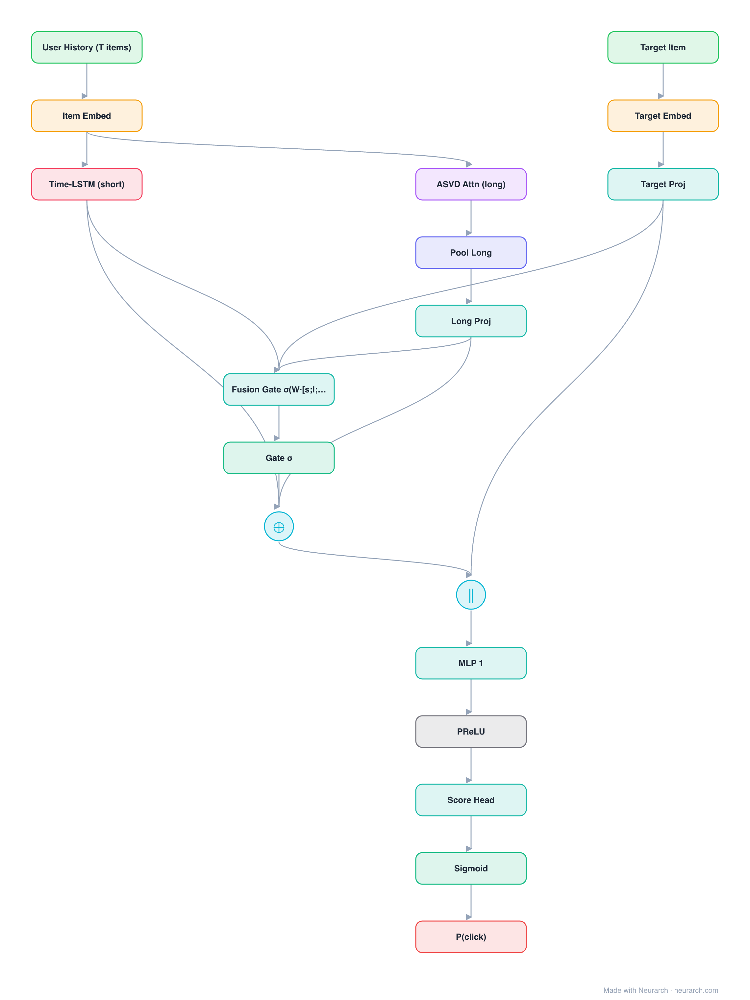

# SLi-Rec

Short- and Long-term interest Recommender: a Time-aware LSTM models the evolving short-term interest while an attentive ASVD component captures stable long-term preference, fused adaptively.

## Model URLs

| Where | URL |
|---|---|
| **Open in Neurarch** (live, editable graph) | https://www.neurarch.com/?import=https://raw.githubusercontent.com/neurarch-ai/awesome-llm-model-zoo/main/architectures/sli-rec/model.json |
| Paper (Yu et al. 2019, IJCAI) | https://www.ijcai.org/proceedings/2019/585 |
| GitHub (microsoft/recommenders) | https://github.com/recommenders-team/recommenders |

## Architecture

<b>Layer-by-layer (18 nodes)</b>

| # | Layer | Type | Params |
|---|---|---|---|
| 1 | User History (T items) | `input` | shape: [50] |
| 2 | Item Embed | `embedding` | vocabSize: 1000000, embeddingDim: 32 |
| 3 | Time-LSTM (short) | `lstm` | inFeatures: 32, hiddenSize: 64, numLayers: 1, returnSequences: false |
| 4 | ASVD Attn (long) | `selfAttention` | dModel: 32, numHeads: 4 |
| 5 | Pool Long | `globalAvgPool1d` |   |
| 6 | Long Proj | `linear` | inFeatures: 32, outFeatures: 64 |
| 7 | Target Item | `input` | shape: [1] |
| 8 | Target Embed | `embedding` | vocabSize: 1000000, embeddingDim: 32 |
| 9 | Target Proj | `linear` | inFeatures: 32, outFeatures: 64 |
| 10 | Fusion Gate σ(W·[s;l;t]) | `linear` | inFeatures: 192, outFeatures: 64 |
| 11 | Gate σ | `sigmoid` |   |
| 12 | α·short + (1−α)·long | `add` | numInputs: 2 |
| 13 | Concat [user, target] | `concatenate` | dim: -1, numInputs: 2 |
| 14 | MLP 1 | `linear` | inFeatures: 128, outFeatures: 64 |
| 15 | PReLU | `prelu` |   |
| 16 | Score Head | `linear` | inFeatures: 64, outFeatures: 1 |
| 17 | Sigmoid | `sigmoid` |   |
| 18 | P(click) | `output` |   |

This graph ships in Neurarch's in-app template library; the copy here passes shape propagation with zero errors.

## Design notes

- Time-aware LSTM gates take the irregular gaps between user actions as input, not just the order.
- The adaptive fusion learns per-user, per-moment weighting between the long- and short-term signals.

## Files

| File | What it is |
|---|---|
| [`model.json`](model.json) | The Neurarch graph. Shape-validated; open it at [neurarch.com](https://www.neurarch.com/) to edit or export training code. |
| [`assets/diagram.svg`](assets/diagram.svg) | Vector diagram (papers, slides). |
| [`assets/diagram.png`](assets/diagram.png) | Raster diagram (renders everywhere). |
