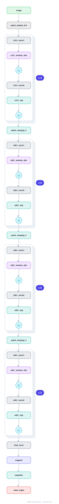

# Swin Transformer (Tiny)

The Vision Transformer that became a general-purpose backbone. Self-attention runs inside fixed local windows (linear cost in image size), and every other block shifts the windows so information crosses window boundaries, while patch merging builds a CNN-like pyramid.

## Model URLs

| Where | URL |
|---|---|
| **Open in Neurarch** (live, editable graph) | https://www.neurarch.com/?import=https://raw.githubusercontent.com/neurarch-ai/awesome-llm-model-zoo/main/architectures/swin-tiny/model.json |
| Paper (Liu et al. 2021) | https://arxiv.org/abs/2103.14030 |
| Hugging Face | https://huggingface.co/microsoft/swin-tiny-patch4-window7-224 |

## Architecture

*Identical repeated blocks are folded into one representative block with a `× N` badge, so the whole architecture fits on screen. `model.json` keeps all 81 nodes (open it in Neurarch to see and edit every layer). Vector: [diagram.svg](assets/diagram.svg).*

| Hyperparameter | Value |
|---|---|
| Type | Hierarchical Vision Transformer |
| Parameters | 28M |
| Patch embed | 4x4 conv (96) |
| Stages | 4 stages, depths 2/2/6/2 |
| Block | Window attention, alternating with shifted-window attention |
| Downsampling | Patch merging (2x2 → linear) between stages |

`model.json` is the full graph, hand-built against the official config.json.

## Parameter check

Neurarch's per-layer parameter estimate over this graph: **28.3M**.

## Design notes

- Windowed attention makes cost linear in pixels (not quadratic like ViT), so Swin scales to detection/segmentation resolutions.
- The shifted-window trick (alternating W-MSA and SW-MSA) is what lets non-adjacent windows communicate without global attention.
- Hierarchical (4 stages, halving resolution and doubling channels) so it drops into FPN-style dense-prediction heads; compare with the flat [vit-b16](../vit-b16/).

## Files

| File | What it is |
|---|---|
| [`model.json`](model.json) | The full Neurarch graph (every layer, real dimensions). Open it at [neurarch.com](https://www.neurarch.com/) to edit or export training code. |
| [`assets/diagram.svg`](assets/diagram.svg) / [`.png`](assets/diagram.png) | Architecture diagram (repeated blocks folded with a `× N` badge). |

**License:** MIT. The graph and diagrams here describe the architecture; any referenced weights remain under the upstream license.
