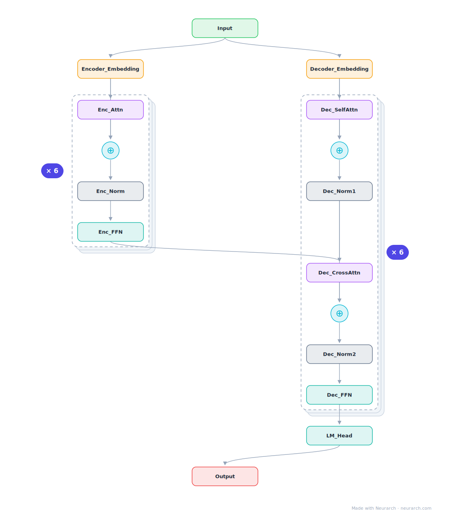

# T5-Small

The text-to-text encoder-decoder that reframed every NLP task as sequence generation. This graph shows the full two-stream layout: bidirectional encoder, causal decoder, and cross-attention tying them together.

## Model URLs

| Where | URL |
|---|---|
| **Open in Neurarch** (live, editable graph) | https://www.neurarch.com/?import=https://raw.githubusercontent.com/neurarch-ai/neurarch-model-zoo/main/architectures/t5-small/model.json |
| Paper (Raffel et al. 2019) | https://arxiv.org/abs/1910.10683 |
| Hugging Face | https://huggingface.co/google-t5/t5-small |

## Architecture

<b>Layer-by-layer (23 nodes)</b>

| # | Layer | Type | Params |
|---|---|---|---|
| 1 | encoder_ids | `input` | shape: [1, 512] |
| 2 | shared_embed | `embedding` | numEmbeddings: 32128, embeddingDim: 512 |
| 3 | enc_norm | `rmsNorm` | normalizedShape: 512 |
| 4 | enc_self_attn | `multiHeadAttention` | embedDim: 512, numHeads: 8 |
| 5 | enc_residual | `add` |   |
| 6 | enc_ffn_norm | `rmsNorm` | normalizedShape: 512 |
| 7 | enc_ffn | `feedForward` | embedDim: 512, ffDim: 2048 |
| 8 | enc_ffn_residual | `add` |   |
| 9 | enc_out_norm | `layerNorm` | normalizedShape: 512 |
| 10 | decoder_ids | `input` | shape: [1, 128] |
| 11 | dec_embed | `embedding` | numEmbeddings: 32128, embeddingDim: 512 |
| 12 | dec_sa_norm | `rmsNorm` | normalizedShape: 512 |
| 13 | dec_self_attn | `causalAttention` | embedDim: 512, numHeads: 8 |
| 14 | dec_sa_residual | `add` |   |
| 15 | dec_ca_norm | `rmsNorm` | normalizedShape: 512 |
| 16 | cross_attn | `multiHeadAttention` | embedDim: 512, numHeads: 8 |
| 17 | dec_ca_residual | `add` |   |
| 18 | dec_ffn_norm | `rmsNorm` | normalizedShape: 512 |
| 19 | dec_ffn | `feedForward` | embedDim: 512, ffDim: 2048 |
| 20 | dec_ffn_residual | `add` |   |
| 21 | dec_out_norm | `layerNorm` | normalizedShape: 512 |
| 22 | lm_head | `linear` | outFeatures: 32128 |
| 23 | logits | `output` |   |

This graph ships in Neurarch's in-app template library; the copy here passes shape propagation with zero errors.

## Design notes

- Both streams share one 32128-token SentencePiece embedding matrix.
- RMSNorm (T5 called it "simplified LayerNorm") years before the Llama lineage made it standard; relative position biases instead of absolute embeddings.
- The graph makes the three attention types visually distinct: encoder self-attention, decoder causal self-attention, and cross-attention.

## Files

| File | What it is |
|---|---|
| [`model.json`](model.json) | The Neurarch graph. Shape-validated; open it at [neurarch.com](https://www.neurarch.com/) to edit or export training code. |
| [`assets/diagram.svg`](assets/diagram.svg) | Vector diagram (papers, slides). |
| [`assets/diagram.png`](assets/diagram.png) | Raster diagram (renders everywhere). |

**License:** Apache 2.0. The graph and diagrams here describe the architecture; any referenced weights remain under the upstream license.
