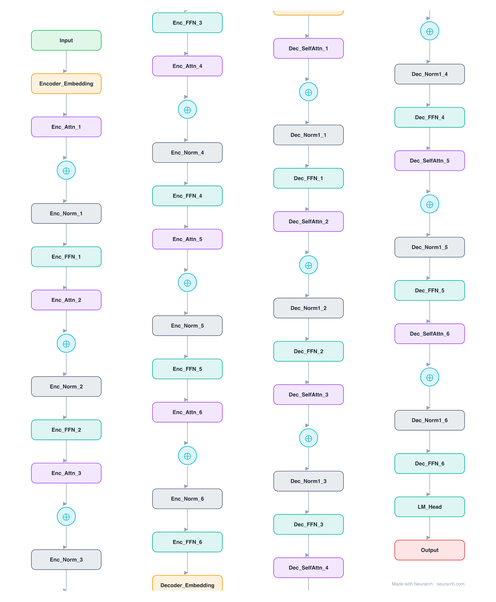

# T5-Small

The text-to-text encoder-decoder that reframed every NLP task as sequence generation. The full two-stream graph: bidirectional encoder, causal decoder, and cross-attention tying them together.

## Model URLs

| Where | URL |
|---|---|
| **Open in Neurarch** (live, editable graph) | https://www.neurarch.com/?import=https://raw.githubusercontent.com/neurarch-ai/awesome-llm-model-zoo/main/architectures/t5-small/model.json |
| Paper (Raffel et al. 2019) | https://arxiv.org/abs/1910.10683 |
| Hugging Face | https://huggingface.co/google-t5/t5-small |

## Architecture

*Identical repeated blocks are folded into one representative block with a `× N` badge, so the whole architecture fits on screen. `model.json` keeps all 53 nodes (open it in Neurarch to see and edit every layer). Vector: [diagram.svg](assets/diagram.svg).*

| Hyperparameter | Value |
|---|---|
| Type | Encoder-decoder transformer (text-to-text) |
| Parameters | 60.5M |
| Layers | 6 encoder + 6 decoder |
| Hidden size | 512 |
| Attention | 8 heads; decoder adds cross-attention |
| FFN | Dense, 2048, ReLU |
| Normalization | RMSNorm, pre-norm |
| Positions | Relative position biases |
| Vocabulary | 32,128 (shared) |

`model.json` is the full graph, produced with the same import path the Neurarch app uses for "load from Hugging Face".

## Parameter check

Neurarch's per-layer parameter estimate over this graph: **87.2M**.
Hugging Face safetensors metadata reports **60.5M** for the real weights.
Deviation from the authoritative count (60.5M): **+44.1%**.

> T5 ties the encoder embedding, decoder embedding, and LM head to one 16.4M-parameter matrix; the graph carries each occurrence separately, so the naive per-layer sum overcounts by roughly 27M. The real unique count is 60.5M (safetensors).

## Design notes

- Both streams and the LM head share one 32128-token SentencePiece embedding matrix (see the parameter note below).
- RMSNorm (T5 called it "simplified LayerNorm") years before the Llama lineage made it standard; relative position biases instead of absolute embeddings.
- The graph makes the three attention types visually distinct: encoder self-attention, decoder causal self-attention, and cross-attention.

## Files

| File | What it is |
|---|---|
| [`model.json`](model.json) | The full Neurarch graph (every layer, real dimensions). Open it at [neurarch.com](https://www.neurarch.com/) to edit or export training code. |
| [`assets/diagram.svg`](assets/diagram.svg) / [`.png`](assets/diagram.png) | Architecture diagram (repeated blocks folded with a `× N` badge). |

**License:** Apache 2.0. The graph and diagrams here describe the architecture; any referenced weights remain under the upstream license.
