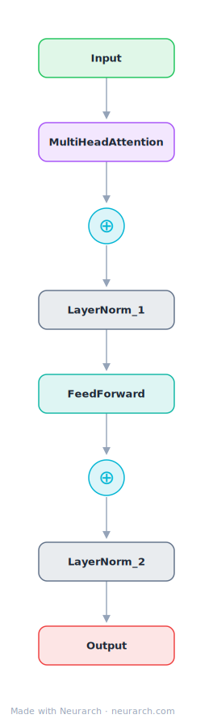

# Transformer Encoder Block

The original "Attention Is All You Need" encoder block: multi-head self-attention and a position-wise FFN, each wrapped in residual + post-LayerNorm.

## Model URLs

| Where | URL |
|---|---|
| **Open in Neurarch** (live, editable graph) | https://www.neurarch.com/?import=https://raw.githubusercontent.com/neurarch-ai/neurarch-model-zoo/main/architectures/transformer-block/model.json |
| Paper (Vaswani et al. 2017) | https://arxiv.org/abs/1706.03762 |

## Architecture

<b>Layer-by-layer (8 nodes)</b>

| # | Layer | Type | Params |
|---|---|---|---|
| 1 | Input | `input` | shape: [512, 768] |
| 2 | MultiHeadAttention | `multiHeadAttention` | numHeads: 8, hiddenDim: 768 |
| 3 | Add_1 | `add` |   |
| 4 | LayerNorm_1 | `layerNorm` |   |
| 5 | FeedForward | `feedForward` | hiddenDim: 768, ffDim: 3072 |
| 6 | Add_2 | `add` |   |
| 7 | LayerNorm_2 | `layerNorm` |   |
| 8 | Output | `output` |   |

This graph ships in Neurarch's in-app template library; the copy here passes shape propagation with zero errors.

## Design notes

- Post-norm ordering as published in 2017; nearly every modern descendant flipped to pre-norm for training stability.
- The minimal pedagogical graph: 8 nodes, two residual streams, nothing else.
- Fork point for trying attention or norm variants with instant shape re-validation.

## Files

| File | What it is |
|---|---|
| [`model.json`](model.json) | The Neurarch graph. Shape-validated; open it at [neurarch.com](https://www.neurarch.com/) to edit or export training code. |
| [`assets/diagram.svg`](assets/diagram.svg) | Vector diagram (papers, slides). |
| [`assets/diagram.png`](assets/diagram.png) | Raster diagram (renders everywhere). |
