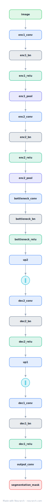

# U-Net

The encoder-decoder with skip connections that owns biomedical and dense-prediction segmentation. Contracting path captures context, expanding path recovers resolution, skips carry the detail across.

## Model URLs

| Where | URL |
|---|---|
| **Open in Neurarch** (live, editable graph) | https://www.neurarch.com/?import=https://raw.githubusercontent.com/neurarch-ai/neurarch-model-zoo/main/architectures/unet/model.json |
| Paper (Ronneberger et al. 2015) | https://arxiv.org/abs/1505.04597 |

## Architecture

<b>Layer-by-layer (24 nodes)</b>

| # | Layer | Type | Params |
|---|---|---|---|
| 1 | image | `input` | shape: [3, 256, 256] |
| 2 | enc1_conv | `conv2d` | outChannels: 64, kernelSize: 3, stride: 1, padding: 1 |
| 3 | enc1_bn | `batchNorm` | numFeatures: 64 |
| 4 | enc1_relu | `relu` |   |
| 5 | enc1_pool | `maxpool2d` | kernelSize: 2, stride: 2 |
| 6 | enc2_conv | `conv2d` | outChannels: 128, kernelSize: 3, stride: 1, padding: 1 |
| 7 | enc2_bn | `batchNorm` | numFeatures: 128 |
| 8 | enc2_relu | `relu` |   |
| 9 | enc2_pool | `maxpool2d` | kernelSize: 2, stride: 2 |
| 10 | bottleneck_conv | `conv2d` | outChannels: 256, kernelSize: 3, stride: 1, padding: 1 |
| 11 | bottleneck_bn | `batchNorm` | numFeatures: 256 |
| 12 | bottleneck_relu | `relu` |   |
| 13 | up2 | `transposeConv2d` | outChannels: 128, kernelSize: 2, stride: 2 |
| 14 | dec2_skip | `concatenate` | axis: 1 |
| 15 | dec2_conv | `conv2d` | outChannels: 128, kernelSize: 3, stride: 1, padding: 1 |
| 16 | dec2_bn | `batchNorm` | numFeatures: 128 |
| 17 | dec2_relu | `relu` |   |
| 18 | up1 | `transposeConv2d` | outChannels: 64, kernelSize: 2, stride: 2 |
| 19 | dec1_skip | `concatenate` | axis: 1 |
| 20 | dec1_conv | `conv2d` | outChannels: 64, kernelSize: 3, stride: 1, padding: 1 |
| 21 | dec1_bn | `batchNorm` | numFeatures: 64 |
| 22 | dec1_relu | `relu` |   |
| 23 | output_conv | `conv2d` | outChannels: 1, kernelSize: 1, stride: 1, padding: 0 |
| 24 | segmentation_mask | `output` |   |

This graph ships in Neurarch's in-app template library; the copy here passes shape propagation with zero errors.

## Design notes

- The long skip connections (encoder level i concatenated into decoder level i) are the defining feature; without them the decoder cannot localize.
- Still the backbone shape of choice ten years on, including inside latent diffusion models (see [diffusion-unet](../diffusion-unet/)).

## Files

| File | What it is |
|---|---|
| [`model.json`](model.json) | The Neurarch graph. Shape-validated; open it at [neurarch.com](https://www.neurarch.com/) to edit or export training code. |
| [`assets/diagram.svg`](assets/diagram.svg) | Vector diagram (papers, slides). |
| [`assets/diagram.png`](assets/diagram.png) | Raster diagram (renders everywhere). |
