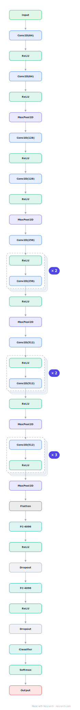

# VGG-16

The architecture that proved depth plus uniform 3x3 convolutions beats clever filter engineering. Sixteen weight layers in five conv stages with the classic 138M-parameter dense head.

## Model URLs

| Where | URL |
|---|---|
| **Open in Neurarch** (live, editable graph) | https://www.neurarch.com/?import=https://raw.githubusercontent.com/neurarch-ai/neurarch-model-zoo/main/architectures/vgg-16/model.json |
| Paper (Simonyan and Zisserman 2014) | https://arxiv.org/abs/1409.1556 |

## Architecture

<b>Layer-by-layer (42 nodes)</b>

| # | Layer | Type | Params |
|---|---|---|---|
| 1 | Input | `input` | shape: [3, 224, 224] |
| 2 | Conv2D(64) | `conv2d` | outChannels: 64, kernelSize: 3, stride: 1, padding: 1, inChannels: 3 |
| 3 | ReLU | `relu` |   |
| 4 | Conv2D(64) | `conv2d` | outChannels: 64, kernelSize: 3, stride: 1, padding: 1, inChannels: 64 |
| 5 | ReLU | `relu` |   |
| 6 | MaxPool2D | `maxpool2d` | kernelSize: 2, stride: 2 |
| 7 | Conv2D(128) | `conv2d` | outChannels: 128, kernelSize: 3, stride: 1, padding: 1, inChannels: 64 |
| 8 | ReLU | `relu` |   |
| 9 | Conv2D(128) | `conv2d` | outChannels: 128, kernelSize: 3, stride: 1, padding: 1, inChannels: 128 |
| 10 | ReLU | `relu` |   |
| 11 | MaxPool2D | `maxpool2d` | kernelSize: 2, stride: 2 |
| 12 | Conv2D(256) | `conv2d` | outChannels: 256, kernelSize: 3, stride: 1, padding: 1, inChannels: 128 |
| 13 | ReLU | `relu` |   |
| 14 | Conv2D(256) | `conv2d` | outChannels: 256, kernelSize: 3, stride: 1, padding: 1, inChannels: 256 |
| 15 | ReLU | `relu` |   |
| 16 | Conv2D(256) | `conv2d` | outChannels: 256, kernelSize: 3, stride: 1, padding: 1, inChannels: 256 |
| 17 | ReLU | `relu` |   |
| 18 | MaxPool2D | `maxpool2d` | kernelSize: 2, stride: 2 |
| 19 | Conv2D(512) | `conv2d` | outChannels: 512, kernelSize: 3, stride: 1, padding: 1, inChannels: 256 |
| 20 | ReLU | `relu` |   |
| 21 | Conv2D(512) | `conv2d` | outChannels: 512, kernelSize: 3, stride: 1, padding: 1, inChannels: 512 |
| 22 | ReLU | `relu` |   |
| 23 | Conv2D(512) | `conv2d` | outChannels: 512, kernelSize: 3, stride: 1, padding: 1, inChannels: 512 |
| 24 | ReLU | `relu` |   |
| 25 | MaxPool2D | `maxpool2d` | kernelSize: 2, stride: 2 |
| 26 | Conv2D(512) | `conv2d` | outChannels: 512, kernelSize: 3, stride: 1, padding: 1, inChannels: 512 |
| 27 | ReLU | `relu` |   |
| 28 | Conv2D(512) | `conv2d` | outChannels: 512, kernelSize: 3, stride: 1, padding: 1, inChannels: 512 |
| 29 | ReLU | `relu` |   |
| 30 | Conv2D(512) | `conv2d` | outChannels: 512, kernelSize: 3, stride: 1, padding: 1, inChannels: 512 |
| 31 | ReLU | `relu` |   |
| 32 | MaxPool2D | `maxpool2d` | kernelSize: 2, stride: 2 |
| 33 | Flatten | `flatten` |   |
| 34 | FC-4096 | `linear` | outFeatures: 4096, inFeatures: 25088 |
| 35 | ReLU | `relu` |   |
| 36 | Dropout | `dropout` | p: 0.5 |
| 37 | FC-4096 | `linear` | outFeatures: 4096, inFeatures: 4096 |
| 38 | ReLU | `relu` |   |
| 39 | Dropout | `dropout` | p: 0.5 |
| 40 | Classifier | `linear` | outFeatures: 1000, inFeatures: 4096 |
| 41 | Softmax | `softmax` | dim: -1 |
| 42 | Output | `output` |   |

This graph is generated by Neurarch's architecture parser and passes shape propagation with zero errors.

## Parameter check

Neurarch's per-layer parameter estimate over this graph: **138.4M**.
Deviation from the authoritative count (138.4M): **-0.0%**.

## Design notes

- Design rule: only 3x3 convs and 2x2 max-pools, doubling channels after each pool (64 to 512). Two stacked 3x3 convs see a 5x5 field with fewer parameters and more nonlinearity.
- Roughly 124M of the 138M parameters sit in the three dense layers, the inefficiency that GAP-based heads (ResNet onward) eliminated.
- Still everywhere as a perceptual-loss and style-transfer feature extractor.

## Files

| File | What it is |
|---|---|
| [`model.json`](model.json) | The Neurarch graph. Shape-validated; open it at [neurarch.com](https://www.neurarch.com/) to edit or export training code. |
| [`assets/diagram.svg`](assets/diagram.svg) | Vector diagram (papers, slides). |
| [`assets/diagram.png`](assets/diagram.png) | Raster diagram (renders everywhere). |
