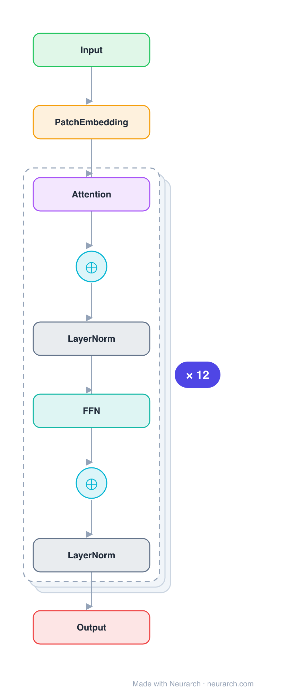

# ViT-B/16

The Vision Transformer that ended CNN hegemony in image classification: 16x16 patch embedding, learned position embeddings, and a stack of standard pre-norm Transformer encoder blocks.

## Model URLs

| Where | URL |
|---|---|
| **Open in Neurarch** (live, editable graph) | https://www.neurarch.com/?import=https://raw.githubusercontent.com/neurarch-ai/neurarch-model-zoo/main/architectures/vit-b16/model.json |
| Paper (Dosovitskiy et al. 2020) | https://arxiv.org/abs/2010.11929 |
| Hugging Face | https://huggingface.co/google/vit-base-patch16-224 |

## Architecture

*Identical repeated blocks are folded into one representative block with a `× N` badge, so the whole architecture fits on screen. `model.json` keeps all 75 nodes (open it in Neurarch to see and edit every layer). Vector: [diagram.svg](assets/diagram.svg).*

| Hyperparameter | Value |
|---|---|
| Type | Vision Transformer (image classification) |
| Parameters | 86M |
| Layers | 12 encoder blocks |
| Hidden size | 768 |
| Attention | Multi-head: 12 heads |
| FFN | Dense MLP, 3072, GeLU |
| Normalization | LayerNorm, pre-norm |
| Positions | Learned, 196 patches + class token |
| Patch size | 16x16 over 224x224 input |

`model.json` is the full graph, produced with the same import path the Neurarch app uses for "load from Hugging Face".

## Parameter check

Neurarch's per-layer parameter estimate over this graph: **85.2M**.
Hugging Face safetensors metadata reports **86.6M** for the real weights.
Deviation from the authoritative count (86.6M): **-1.6%**.

## Design notes

- The patch-embed stem is just a strided conv: 3x224x224 becomes 196 patch tokens of 768 dims (plus the class token).
- Identical block to BERT but pre-norm; the inductive-bias-free design needs large-scale pretraining to win.
- The full 12-block stack lives in model.json; the block view shows one encoder block expanded.

## Files

| File | What it is |
|---|---|
| [`model.json`](model.json) | The full Neurarch graph (every layer, real dimensions). Open it at [neurarch.com](https://www.neurarch.com/) to edit or export training code. |
| [`assets/diagram.svg`](assets/diagram.svg) / [`.png`](assets/diagram.png) | Architecture diagram (repeated blocks folded with a `× N` badge). |

**License:** Apache 2.0. The graph and diagrams here describe the architecture; any referenced weights remain under the upstream license.
