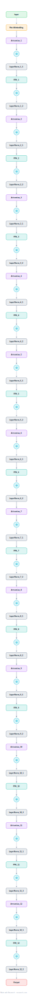

# ViT-B/16

The Vision Transformer that ended CNN hegemony in image classification: 16x16 patch embedding, learned position embeddings, and a stack of standard pre-norm Transformer encoder blocks.

## Model URLs

| Where | URL |
|---|---|
| **Open in Neurarch** (live, editable graph) | https://www.neurarch.com/?import=https://raw.githubusercontent.com/neurarch-ai/neurarch-model-zoo/main/architectures/vit-b16/model.json |
| Paper (Dosovitskiy et al. 2020) | https://arxiv.org/abs/2010.11929 |
| Hugging Face | https://huggingface.co/google/vit-base-patch16-224 |

## Architecture

<b>Layer-by-layer (13 nodes)</b>

| # | Layer | Type | Params |
|---|---|---|---|
| 1 | image | `input` | shape: [3, 224, 224] |
| 2 | patch_embed | `patchEmbed` | imgSize: 224, patchSize: 16, inChans: 3, embedDim: 768 |
| 3 | pos_embed | `positionalEncoding` | maxLen: 197, embedDim: 768 |
| 4 | dropout | `dropout` | p: 0 |
| 5 | norm_1 | `layerNorm` | normalizedShape: 768 |
| 6 | attn | `multiHeadAttention` | embedDim: 768, numHeads: 12 |
| 7 | residual_1 | `add` |   |
| 8 | norm_2 | `layerNorm` | normalizedShape: 768 |
| 9 | mlp | `feedForward` | hiddenDim: 768, ffDim: 3072 |
| 10 | residual_2 | `add` |   |
| 11 | norm_final | `layerNorm` | normalizedShape: 768 |
| 12 | head | `linear` | outFeatures: 1000 |
| 13 | class_logits | `output` |   |

This graph ships in Neurarch's in-app template library; the copy here passes shape propagation with zero errors.

## Design notes

- The patch-embed stem is just a strided conv: 3x224x224 becomes 196 patch tokens of 768 dims (plus the class token).
- One of the 12 identical encoder blocks is expanded (MHA 12 heads, MLP 3072, pre-norm, both residuals); the stack repeats x12.
- Identical block to BERT but pre-norm; the inductive-bias-free design needs large-scale pretraining to win.

## Files

| File | What it is |
|---|---|
| [`model.json`](model.json) | The Neurarch graph. Shape-validated; open it at [neurarch.com](https://www.neurarch.com/) to edit or export training code. |
| [`assets/diagram.svg`](assets/diagram.svg) | Vector diagram (papers, slides). |
| [`assets/diagram.png`](assets/diagram.png) | Raster diagram (renders everywhere). |

**License:** Apache 2.0. The graph and diagrams here describe the architecture; any referenced weights remain under the upstream license.
