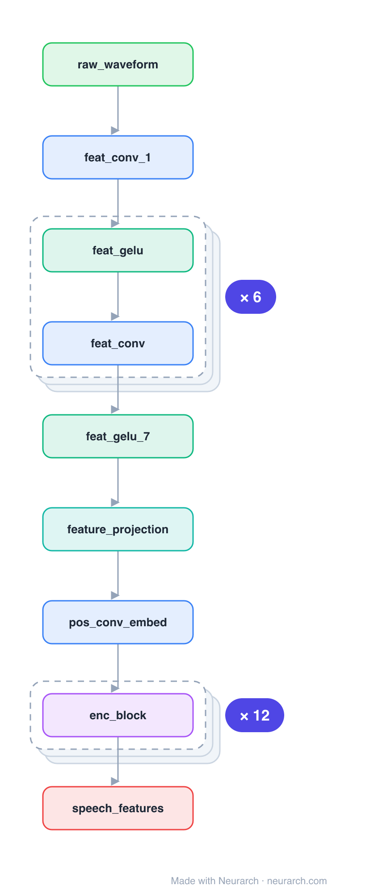

# Wav2Vec2 base

The model that made self-supervised speech work: a convolutional feature extractor turns the raw 16kHz waveform into latent frames, a Transformer contextualizes them, and contrastive masked prediction over a learned codebook does the pretraining. Fine-tune with a tiny head and it beats systems trained on 100x the labels.

## Model URLs

| Where | URL |
|---|---|
| **Open in Neurarch** (live, editable graph) | https://www.neurarch.com/?import=https://raw.githubusercontent.com/neurarch-ai/awesome-llm-model-zoo/main/architectures/wav2vec2-base/model.json |
| Paper (Baevski et al. 2020) | https://arxiv.org/abs/2006.11477 |
| Hugging Face | https://huggingface.co/facebook/wav2vec2-base-960h |

## Architecture

*Identical repeated blocks are folded into one representative block with a `× N` badge, so the whole architecture fits on screen. `model.json` keeps all 30 nodes (open it in Neurarch to see and edit every layer). Vector: [diagram.svg](assets/diagram.svg).*

| Hyperparameter | Value |
|---|---|
| Type | Self-supervised speech encoder |
| Parameters | 95M |
| Feature extractor | 7 Conv1D layers (raw waveform → 20ms frames) |
| Encoder | 12 Transformer blocks, 768 hidden, 12 heads |
| Positions | Convolutional positional embedding |
| Pretraining | Contrastive masked prediction over quantized latents |

`model.json` is the full graph, hand-built against the official config.json.

## Parameter check

Neurarch's per-layer parameter estimate over this graph: **165.7M**.

## Design notes

- The 7-layer conv stack is the audio analogue of patch embedding: it downsamples raw audio to ~50 frames/sec before the Transformer ever sees it.
- Positions come from a depthwise conv over the sequence (a convolutional positional embedding), not sinusoids.
- Compare with [whisper-small](../whisper-small/): both put a conv stem before a Transformer, but Whisper is supervised seq2seq while Wav2Vec2 is self-supervised representation learning.

## Files

| File | What it is |
|---|---|
| [`model.json`](model.json) | The full Neurarch graph (every layer, real dimensions). Open it at [neurarch.com](https://www.neurarch.com/) to edit or export training code. |
| [`assets/diagram.svg`](assets/diagram.svg) / [`.png`](assets/diagram.png) | Architecture diagram (repeated blocks folded with a `× N` badge). |

**License:** Apache 2.0. The graph and diagrams here describe the architecture; any referenced weights remain under the upstream license.
