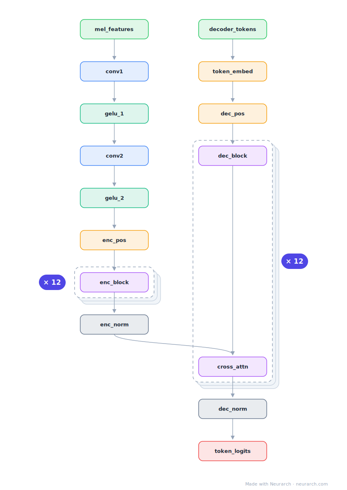

# Whisper Small

OpenAI's speech recognition encoder-decoder: log-mel spectrogram through a two-layer conv stem into a Transformer encoder, with a causal text decoder cross-attending to the audio states.

## Model URLs

| Where | URL |
|---|---|
| **Open in Neurarch** (live, editable graph) | https://www.neurarch.com/?import=https://raw.githubusercontent.com/neurarch-ai/neurarch-model-zoo/main/architectures/whisper-small/model.json |
| Paper (Radford et al. 2022) | https://arxiv.org/abs/2212.04356 |
| GitHub | https://github.com/openai/whisper |
| Hugging Face | https://huggingface.co/openai/whisper-small |

## Architecture

<b>Layer-by-layer (17 nodes)</b>

| # | Layer | Type | Params |
|---|---|---|---|
| 1 | mel_features | `input` | shape: [1, 80, 3000] |
| 2 | conv1 | `audioConv` | outChannels: 384, kernelSize: 3, stride: 1, padding: 1 |
| 3 | gelu_1 | `gelu` |   |
| 4 | conv2 | `audioConv` | outChannels: 384, kernelSize: 3, stride: 2, padding: 1 |
| 5 | gelu_2 | `gelu` |   |
| 6 | enc_pos_emb | `positionalEncoding` | maxLen: 1500, embedDim: 384 |
| 7 | enc_block_1 | `transformerBlock` | embedDim: 384, numHeads: 6, ffDim: 1536 |
| 8 | enc_block_2 | `transformerBlock` | embedDim: 384, numHeads: 6, ffDim: 1536 |
| 9 | enc_norm | `layerNorm` | normalizedShape: 384 |
| 10 | decoder_tokens | `input` | shape: [1, 448] |
| 11 | token_embed | `embedding` | numEmbeddings: 51865, embeddingDim: 384 |
| 12 | dec_pos_emb | `positionalEncoding` | maxLen: 448, embedDim: 384 |
| 13 | dec_block_1 | `transformerBlock` | embedDim: 384, numHeads: 6, ffDim: 1536 |
| 14 | dec_block_2 | `transformerBlock` | embedDim: 384, numHeads: 6, ffDim: 1536 |
| 15 | dec_norm | `layerNorm` | normalizedShape: 384 |
| 16 | lm_head | `linear` | outFeatures: 51865 |
| 17 | token_logits | `output` |   |

This graph ships in Neurarch's in-app template library; the copy here passes shape propagation with zero errors.

## Design notes

- The conv stem (two 1D convs with GeLU) downsamples the 80-channel mel input 2x before the encoder; everything after is a vanilla Transformer.
- Trained on 680k hours of weakly supervised audio; the architecture is intentionally boring so the data does the work.
- The graph shows both streams plus cross-attention, the same enc-dec wiring as T5 with an audio front-end.

## Files

| File | What it is |
|---|---|
| [`model.json`](model.json) | The Neurarch graph. Shape-validated; open it at [neurarch.com](https://www.neurarch.com/) to edit or export training code. |
| [`assets/diagram.svg`](assets/diagram.svg) | Vector diagram (papers, slides). |
| [`assets/diagram.png`](assets/diagram.png) | Raster diagram (renders everywhere). |

**License:** MIT. The graph and diagrams here describe the architecture; any referenced weights remain under the upstream license.
