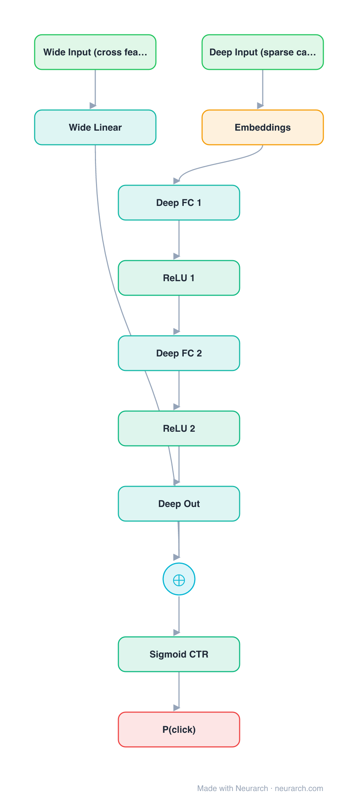

# Wide & Deep

Google's Play-store ranking model that joint-trains a wide linear path (memorization of cross features) with a deep embedding MLP (generalization), summed at the logit.

## Model URLs

| Where | URL |
|---|---|
| **Open in Neurarch** (live, editable graph) | https://www.neurarch.com/?import=https://raw.githubusercontent.com/neurarch-ai/awesome-llm-model-zoo/main/architectures/wide-and-deep/model.json |
| Paper (Cheng et al. 2016) | https://arxiv.org/abs/1606.07792 |

## Architecture

<b>Layer-by-layer (12 nodes)</b>

| # | Layer | Type | Params |
|---|---|---|---|
| 1 | Wide Input (cross feats) | `input` | shape: [10000] |
| 2 | Wide Linear | `linear` | inFeatures: 10000, outFeatures: 1 |
| 3 | Deep Input (sparse cat) | `input` | shape: [50] |
| 4 | Embeddings | `embedding` | vocabSize: 100000, embeddingDim: 32 |
| 5 | Deep FC 1 | `linear` | inFeatures: 1600, outFeatures: 256 |
| 6 | ReLU 1 | `relu` |   |
| 7 | Deep FC 2 | `linear` | inFeatures: 256, outFeatures: 128 |
| 8 | ReLU 2 | `relu` |   |
| 9 | Deep Out | `linear` | inFeatures: 128, outFeatures: 1 |
| 10 | Wide + Deep | `add` |   |
| 11 | Sigmoid CTR | `sigmoid` |   |
| 12 | P(click) | `output` |   |

This graph ships in Neurarch's in-app template library; the copy here passes shape propagation with zero errors.

## Design notes

- The wide path memorizes specific feature crosses; the deep path generalizes to unseen ones; the sum gets both behaviors in one model.
- The conceptual ancestor of DeepFM, DCN, and most hybrid CTR architectures since.

## Files

| File | What it is |
|---|---|
| [`model.json`](model.json) | The Neurarch graph. Shape-validated; open it at [neurarch.com](https://www.neurarch.com/) to edit or export training code. |
| [`assets/diagram.svg`](assets/diagram.svg) | Vector diagram (papers, slides). |
| [`assets/diagram.png`](assets/diagram.png) | Raster diagram (renders everywhere). |
